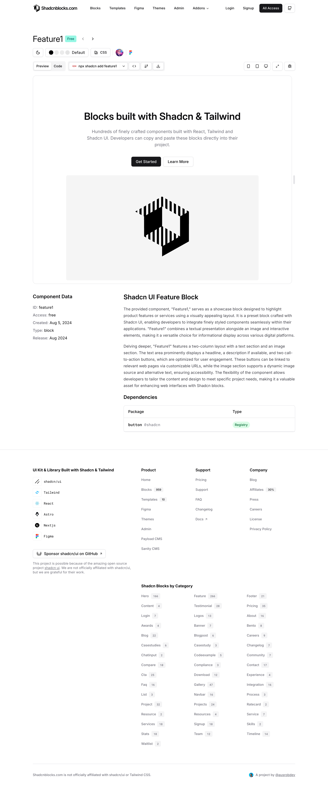
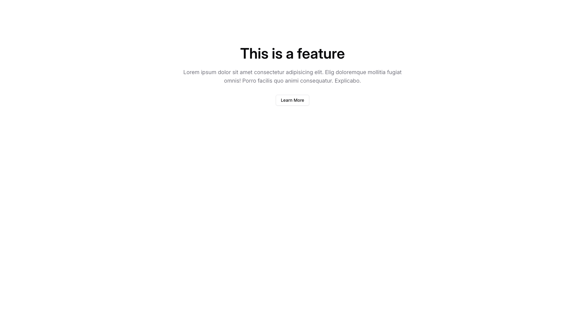

# Feature Blocks (265)

Feature grids, comparisons, and showcases for product capabilities. Highlight key functionality and benefits.

---

## feature1

Three-column featuring structured content presentation and clear visual hierarchy. Displays image tiles and description text for enhanced user engagement. Perfect for service pages and conversion-focused applications. Organized design with responsive structure and mobile-optimized layout. Best applied in scenarios requiring service pages with professional visual impact.

**Install**: `pnpm dlx shadcn add @shadcnblocks/feature1`

---

## feature2

Stacked cards including structured content presentation and clear visual hierarchy. Showcases minimal badges and CTA links for enhanced user engagement. Excellent for product details and conversion-focused applications. Scannable design with responsive structure and mobile-optimized layout. Best applied in scenarios requiring product details with professional visual impact.

**Install**: `pnpm dlx shadcn add @shadcnblocks/feature2`

---

## feature3

Centered column containing structured content presentation and clear visual hierarchy. Includes bordered cards and badge labels for enhanced user engagement. Optimal for benefit presentations and conversion-focused applications. Modular design with responsive structure and mobile-optimized layout. Best applied in scenarios requiring benefit presentations with professional visual impact.

**Install**: `pnpm dlx shadcn add @shadcnblocks/feature3`

---

## feature4

Grid layout with structured content presentation and clear visual hierarchy. Features icon cards and icon headings for enhanced user engagement. Ideal for feature showcases and conversion-focused applications. Clean design with responsive structure and mobile-optimized layout. Best applied in scenarios requiring feature showcases with professional visual impact.

**Install**: `pnpm dlx shadcn add @shadcnblocks/feature4`

---

## feature5

Three-column featuring structured content presentation and clear visual hierarchy. Displays image tiles and description text for enhanced user engagement. Perfect for service pages and conversion-focused applications. Organized design with responsive structure and mobile-optimized layout. Best applied in scenarios requiring service pages with professional visual impact.

**Install**: `pnpm dlx shadcn add @shadcnblocks/feature5`

---

## feature6

Stacked cards including structured content presentation and clear visual hierarchy. Showcases minimal badges and CTA links for enhanced user engagement. Excellent for product details and conversion-focused applications. Scannable design with responsive structure and mobile-optimized layout. Best applied in scenarios requiring product details with professional visual impact.

**Install**: `pnpm dlx shadcn add @shadcnblocks/feature6`

---

## feature7

Alternating rows incorporating structured content presentation and clear visual hierarchy. Presents gradient accents and feature cards for enhanced user engagement. Well-suited for capability highlights and conversion-focused applications. Professional design with responsive structure and mobile-optimized layout. Best applied in scenarios requiring capability highlights with professional visual impact.

**Install**: `pnpm dlx shadcn add @shadcnblocks/feature7`

---

## feature8

Centered column containing structured content presentation and clear visual hierarchy. Includes bordered cards and badge labels for enhanced user engagement. Optimal for benefit presentations and conversion-focused applications. Modular design with responsive structure and mobile-optimized layout. Best applied in scenarios requiring benefit presentations with professional visual impact.

**Install**: `pnpm dlx shadcn add @shadcnblocks/feature8`

---

## feature9

Grid layout with structured content presentation and clear visual hierarchy. Features icon cards and icon headings for enhanced user engagement. Ideal for feature showcases and conversion-focused applications. Clean design with responsive structure and mobile-optimized layout. Best applied in scenarios requiring feature showcases with professional visual impact.

**Install**: `pnpm dlx shadcn add @shadcnblocks/feature9`

---

## feature10

Stacked cards including structured content presentation and clear visual hierarchy. Showcases minimal badges and CTA links for enhanced user engagement. Excellent for product details and conversion-focused applications. Scannable design with responsive structure and mobile-optimized layout. Best applied in scenarios requiring product details with professional visual impact.

**Install**: `pnpm dlx shadcn add @shadcnblocks/feature10`

---

## feature11

Alternating rows incorporating structured content presentation and clear visual hierarchy. Presents gradient accents and feature cards for enhanced user engagement. Well-suited for capability highlights and conversion-focused applications. Professional design with responsive structure and mobile-optimized layout. Best applied in scenarios requiring capability highlights with professional visual impact.

**Install**: `pnpm dlx shadcn add @shadcnblocks/feature11`

---

## feature12

Centered column containing structured content presentation and clear visual hierarchy. Includes bordered cards and badge labels for enhanced user engagement. Optimal for benefit presentations and conversion-focused applications. Modular design with responsive structure and mobile-optimized layout. Best applied in scenarios requiring benefit presentations with professional visual impact.

**Install**: `pnpm dlx shadcn add @shadcnblocks/feature12`

---

## feature13

Grid layout with structured content presentation and clear visual hierarchy. Features icon cards and icon headings for enhanced user engagement. Ideal for feature showcases and conversion-focused applications. Clean design with responsive structure and mobile-optimized layout. Best applied in scenarios requiring feature showcases with professional visual impact.

**Install**: `pnpm dlx shadcn add @shadcnblocks/feature13`

---

## feature14

Three-column featuring structured content presentation and clear visual hierarchy. Displays image tiles and description text for enhanced user engagement. Perfect for service pages and conversion-focused applications. Organized design with responsive structure and mobile-optimized layout. Best applied in scenarios requiring service pages with professional visual impact.

**Install**: `pnpm dlx shadcn add @shadcnblocks/feature14`

---

## feature15

Stacked cards including structured content presentation and clear visual hierarchy. Showcases minimal badges and CTA links for enhanced user engagement. Excellent for product details and conversion-focused applications. Scannable design with responsive structure and mobile-optimized layout. Best applied in scenarios requiring product details with professional visual impact.

**Install**: `pnpm dlx shadcn add @shadcnblocks/feature15`

---

## feature16

Alternating rows incorporating structured content presentation and clear visual hierarchy. Presents gradient accents and feature cards for enhanced user engagement. Well-suited for capability highlights and conversion-focused applications. Professional design with responsive structure and mobile-optimized layout. Best applied in scenarios requiring capability highlights with professional visual impact.

**Install**: `pnpm dlx shadcn add @shadcnblocks/feature16`

---

## feature17

Centered column containing structured content presentation and clear visual hierarchy. Includes bordered cards and badge labels for enhanced user engagement. Optimal for benefit presentations and conversion-focused applications. Modular design with responsive structure and mobile-optimized layout. Best applied in scenarios requiring benefit presentations with professional visual impact.

**Install**: `pnpm dlx shadcn add @shadcnblocks/feature17`

---

## feature18

Grid layout with structured content presentation and clear visual hierarchy. Features icon cards and icon headings for enhanced user engagement. Ideal for feature showcases and conversion-focused applications. Clean design with responsive structure and mobile-optimized layout. Best applied in scenarios requiring feature showcases with professional visual impact.

**Install**: `pnpm dlx shadcn add @shadcnblocks/feature18`

---

## feature19

Three-column featuring structured content presentation and clear visual hierarchy. Displays image tiles and description text for enhanced user engagement. Perfect for service pages and conversion-focused applications. Organized design with responsive structure and mobile-optimized layout. Best applied in scenarios requiring service pages with professional visual impact.

**Install**: `pnpm dlx shadcn add @shadcnblocks/feature19`

---

## feature20

Alternating rows incorporating structured content presentation and clear visual hierarchy. Presents gradient accents and feature cards for enhanced user engagement. Well-suited for capability highlights and conversion-focused applications. Professional design with responsive structure and mobile-optimized layout. Best applied in scenarios requiring capability highlights with professional visual impact.

**Install**: `pnpm dlx shadcn add @shadcnblocks/feature20`

---

## feature21

Centered column containing structured content presentation and clear visual hierarchy. Includes bordered cards and badge labels for enhanced user engagement. Optimal for benefit presentations and conversion-focused applications. Modular design with responsive structure and mobile-optimized layout. Best applied in scenarios requiring benefit presentations with professional visual impact.

**Install**: `pnpm dlx shadcn add @shadcnblocks/feature21`

---

## feature22

Grid layout with structured content presentation and clear visual hierarchy. Features icon cards and icon headings for enhanced user engagement. Ideal for feature showcases and conversion-focused applications. Clean design with responsive structure and mobile-optimized layout. Best applied in scenarios requiring feature showcases with professional visual impact.

**Install**: `pnpm dlx shadcn add @shadcnblocks/feature22`

---

## feature23

Three-column featuring structured content presentation and clear visual hierarchy. Displays image tiles and description text for enhanced user engagement. Perfect for service pages and conversion-focused applications. Organized design with responsive structure and mobile-optimized layout. Best applied in scenarios requiring service pages with professional visual impact.

**Install**: `pnpm dlx shadcn add @shadcnblocks/feature23`

---

## feature24

Stacked cards including structured content presentation and clear visual hierarchy. Showcases minimal badges and CTA links for enhanced user engagement. Excellent for product details and conversion-focused applications. Scannable design with responsive structure and mobile-optimized layout. Best applied in scenarios requiring product details with professional visual impact.

**Install**: `pnpm dlx shadcn add @shadcnblocks/feature24`

---

## feature25

Alternating rows incorporating structured content presentation and clear visual hierarchy. Presents gradient accents and feature cards for enhanced user engagement. Well-suited for capability highlights and conversion-focused applications. Professional design with responsive structure and mobile-optimized layout. Best applied in scenarios requiring capability highlights with professional visual impact.

**Install**: `pnpm dlx shadcn add @shadcnblocks/feature25`

---

## feature26

Centered column containing structured content presentation and clear visual hierarchy. Includes bordered cards and badge labels for enhanced user engagement. Optimal for benefit presentations and conversion-focused applications. Modular design with responsive structure and mobile-optimized layout. Best applied in scenarios requiring benefit presentations with professional visual impact.

**Install**: `pnpm dlx shadcn add @shadcnblocks/feature26`

---

## feature27

Three-column featuring structured content presentation and clear visual hierarchy. Displays image tiles and description text for enhanced user engagement. Perfect for service pages and conversion-focused applications. Organized design with responsive structure and mobile-optimized layout. Best applied in scenarios requiring service pages with professional visual impact.

**Install**: `pnpm dlx shadcn add @shadcnblocks/feature27`

---

## feature28

Stacked cards including structured content presentation and clear visual hierarchy. Showcases minimal badges and CTA links for enhanced user engagement. Excellent for product details and conversion-focused applications. Scannable design with responsive structure and mobile-optimized layout. Best applied in scenarios requiring product details with professional visual impact.

**Install**: `pnpm dlx shadcn add @shadcnblocks/feature28`

---

## feature29

Alternating rows incorporating structured content presentation and clear visual hierarchy. Presents gradient accents and feature cards for enhanced user engagement. Well-suited for capability highlights and conversion-focused applications. Professional design with responsive structure and mobile-optimized layout. Best applied in scenarios requiring capability highlights with professional visual impact.

**Install**: `pnpm dlx shadcn add @shadcnblocks/feature29`

---

## feature30

Grid layout with structured content presentation and clear visual hierarchy. Features icon cards and icon headings for enhanced user engagement. Ideal for feature showcases and conversion-focused applications. Clean design with responsive structure and mobile-optimized layout. Best applied in scenarios requiring feature showcases with professional visual impact.

**Install**: `pnpm dlx shadcn add @shadcnblocks/feature30`

---

## feature31

Three-column featuring structured content presentation and clear visual hierarchy. Displays image tiles and description text for enhanced user engagement. Perfect for service pages and conversion-focused applications. Organized design with responsive structure and mobile-optimized layout. Best applied in scenarios requiring service pages with professional visual impact.

**Install**: `pnpm dlx shadcn add @shadcnblocks/feature31`

---

## feature32

Stacked cards including structured content presentation and clear visual hierarchy. Showcases minimal badges and CTA links for enhanced user engagement. Excellent for product details and conversion-focused applications. Scannable design with responsive structure and mobile-optimized layout. Best applied in scenarios requiring product details with professional visual impact.

**Install**: `pnpm dlx shadcn add @shadcnblocks/feature32`

---

## feature33

Alternating rows incorporating structured content presentation and clear visual hierarchy. Presents gradient accents and feature cards for enhanced user engagement. Well-suited for capability highlights and conversion-focused applications. Professional design with responsive structure and mobile-optimized layout. Best applied in scenarios requiring capability highlights with professional visual impact.

**Install**: `pnpm dlx shadcn add @shadcnblocks/feature33`

---

## feature34

Centered column containing structured content presentation and clear visual hierarchy. Includes bordered cards and badge labels for enhanced user engagement. Optimal for benefit presentations and conversion-focused applications. Modular design with responsive structure and mobile-optimized layout. Best applied in scenarios requiring benefit presentations with professional visual impact.

**Install**: `pnpm dlx shadcn add @shadcnblocks/feature34`

---

## feature35

Grid layout with structured content presentation and clear visual hierarchy. Features icon cards and icon headings for enhanced user engagement. Ideal for feature showcases and conversion-focused applications. Clean design with responsive structure and mobile-optimized layout. Best applied in scenarios requiring feature showcases with professional visual impact.

**Install**: `pnpm dlx shadcn add @shadcnblocks/feature35`

---

## feature36

Three-column featuring structured content presentation and clear visual hierarchy. Displays image tiles and description text for enhanced user engagement. Perfect for service pages and conversion-focused applications. Organized design with responsive structure and mobile-optimized layout. Best applied in scenarios requiring service pages with professional visual impact.

**Install**: `pnpm dlx shadcn add @shadcnblocks/feature36`

---

## feature37

Stacked cards including structured content presentation and clear visual hierarchy. Showcases minimal badges and CTA links for enhanced user engagement. Excellent for product details and conversion-focused applications. Scannable design with responsive structure and mobile-optimized layout. Best applied in scenarios requiring product details with professional visual impact.

**Install**: `pnpm dlx shadcn add @shadcnblocks/feature37`

---

## feature38

Alternating rows incorporating structured content presentation and clear visual hierarchy. Presents gradient accents and feature cards for enhanced user engagement. Well-suited for capability highlights and conversion-focused applications. Professional design with responsive structure and mobile-optimized layout. Best applied in scenarios requiring capability highlights with professional visual impact.

**Install**: `pnpm dlx shadcn add @shadcnblocks/feature38`

---

## feature39

Centered column containing structured content presentation and clear visual hierarchy. Includes bordered cards and badge labels for enhanced user engagement. Optimal for benefit presentations and conversion-focused applications. Modular design with responsive structure and mobile-optimized layout. Best applied in scenarios requiring benefit presentations with professional visual impact.

**Install**: `pnpm dlx shadcn add @shadcnblocks/feature39`

---

## feature40

Three-column featuring structured content presentation and clear visual hierarchy. Displays image tiles and description text for enhanced user engagement. Perfect for service pages and conversion-focused applications. Organized design with responsive structure and mobile-optimized layout. Best applied in scenarios requiring service pages with professional visual impact.

**Install**: `pnpm dlx shadcn add @shadcnblocks/feature40`

---

## feature41

Stacked cards including structured content presentation and clear visual hierarchy. Showcases minimal badges and CTA links for enhanced user engagement. Excellent for product details and conversion-focused applications. Scannable design with responsive structure and mobile-optimized layout. Best applied in scenarios requiring product details with professional visual impact.

**Install**: `pnpm dlx shadcn add @shadcnblocks/feature41`

---

## feature42

Alternating rows incorporating structured content presentation and clear visual hierarchy. Presents gradient accents and feature cards for enhanced user engagement. Well-suited for capability highlights and conversion-focused applications. Professional design with responsive structure and mobile-optimized layout. Best applied in scenarios requiring capability highlights with professional visual impact.

**Install**: `pnpm dlx shadcn add @shadcnblocks/feature42`

---

## feature43

Centered column containing structured content presentation and clear visual hierarchy. Includes bordered cards and badge labels for enhanced user engagement. Optimal for benefit presentations and conversion-focused applications. Modular design with responsive structure and mobile-optimized layout. Best applied in scenarios requiring benefit presentations with professional visual impact.

**Install**: `pnpm dlx shadcn add @shadcnblocks/feature43`

---

## feature44

Grid layout with structured content presentation and clear visual hierarchy. Features icon cards and icon headings for enhanced user engagement. Ideal for feature showcases and conversion-focused applications. Clean design with responsive structure and mobile-optimized layout. Best applied in scenarios requiring feature showcases with professional visual impact.

**Install**: `pnpm dlx shadcn add @shadcnblocks/feature44`

---

## feature45

Three-column featuring structured content presentation and clear visual hierarchy. Displays image tiles and description text for enhanced user engagement. Perfect for service pages and conversion-focused applications. Organized design with responsive structure and mobile-optimized layout. Best applied in scenarios requiring service pages with professional visual impact.

**Install**: `pnpm dlx shadcn add @shadcnblocks/feature45`

---

## feature46

Stacked cards including structured content presentation and clear visual hierarchy. Showcases minimal badges and CTA links for enhanced user engagement. Excellent for product details and conversion-focused applications. Scannable design with responsive structure and mobile-optimized layout. Best applied in scenarios requiring product details with professional visual impact.

**Install**: `pnpm dlx shadcn add @shadcnblocks/feature46`

---

## feature47

Alternating rows incorporating structured content presentation and clear visual hierarchy. Presents gradient accents and feature cards for enhanced user engagement. Well-suited for capability highlights and conversion-focused applications. Professional design with responsive structure and mobile-optimized layout. Best applied in scenarios requiring capability highlights with professional visual impact.

**Install**: `pnpm dlx shadcn add @shadcnblocks/feature47`

---

## feature48

Centered column containing structured content presentation and clear visual hierarchy. Includes bordered cards and badge labels for enhanced user engagement. Optimal for benefit presentations and conversion-focused applications. Modular design with responsive structure and mobile-optimized layout. Best applied in scenarios requiring benefit presentations with professional visual impact.

**Install**: `pnpm dlx shadcn add @shadcnblocks/feature48`

---

## feature49

Grid layout with structured content presentation and clear visual hierarchy. Features icon cards and icon headings for enhanced user engagement. Ideal for feature showcases and conversion-focused applications. Clean design with responsive structure and mobile-optimized layout. Best applied in scenarios requiring feature showcases with professional visual impact.

**Install**: `pnpm dlx shadcn add @shadcnblocks/feature49`

---

## feature50

Stacked cards including structured content presentation and clear visual hierarchy. Showcases minimal badges and CTA links for enhanced user engagement. Excellent for product details and conversion-focused applications. Scannable design with responsive structure and mobile-optimized layout. Best applied in scenarios requiring product details with professional visual impact.

**Install**: `pnpm dlx shadcn add @shadcnblocks/feature50`

---

## feature51

Alternating rows incorporating structured content presentation and clear visual hierarchy. Presents gradient accents and feature cards for enhanced user engagement. Well-suited for capability highlights and conversion-focused applications. Professional design with responsive structure and mobile-optimized layout. Best applied in scenarios requiring capability highlights with professional visual impact.

**Install**: `pnpm dlx shadcn add @shadcnblocks/feature51`

---

## feature52

Centered column containing structured content presentation and clear visual hierarchy. Includes bordered cards and badge labels for enhanced user engagement. Optimal for benefit presentations and conversion-focused applications. Modular design with responsive structure and mobile-optimized layout. Best applied in scenarios requiring benefit presentations with professional visual impact.

**Install**: `pnpm dlx shadcn add @shadcnblocks/feature52`

---

## feature53

Grid layout with structured content presentation and clear visual hierarchy. Features icon cards and icon headings for enhanced user engagement. Ideal for feature showcases and conversion-focused applications. Clean design with responsive structure and mobile-optimized layout. Best applied in scenarios requiring feature showcases with professional visual impact.

**Install**: `pnpm dlx shadcn add @shadcnblocks/feature53`

---

## feature54

Three-column featuring structured content presentation and clear visual hierarchy. Displays image tiles and description text for enhanced user engagement. Perfect for service pages and conversion-focused applications. Organized design with responsive structure and mobile-optimized layout. Best applied in scenarios requiring service pages with professional visual impact.

**Install**: `pnpm dlx shadcn add @shadcnblocks/feature54`

---

## feature55

Stacked cards including structured content presentation and clear visual hierarchy. Showcases minimal badges and CTA links for enhanced user engagement. Excellent for product details and conversion-focused applications. Scannable design with responsive structure and mobile-optimized layout. Best applied in scenarios requiring product details with professional visual impact.

**Install**: `pnpm dlx shadcn add @shadcnblocks/feature55`

---

## feature56

Alternating rows incorporating structured content presentation and clear visual hierarchy. Presents gradient accents and feature cards for enhanced user engagement. Well-suited for capability highlights and conversion-focused applications. Professional design with responsive structure and mobile-optimized layout. Best applied in scenarios requiring capability highlights with professional visual impact.

**Install**: `pnpm dlx shadcn add @shadcnblocks/feature56`

---

## feature57

Centered column containing structured content presentation and clear visual hierarchy. Includes bordered cards and badge labels for enhanced user engagement. Optimal for benefit presentations and conversion-focused applications. Modular design with responsive structure and mobile-optimized layout. Best applied in scenarios requiring benefit presentations with professional visual impact.

**Install**: `pnpm dlx shadcn add @shadcnblocks/feature57`

---

## feature58

Grid layout with structured content presentation and clear visual hierarchy. Features icon cards and icon headings for enhanced user engagement. Ideal for feature showcases and conversion-focused applications. Clean design with responsive structure and mobile-optimized layout. Best applied in scenarios requiring feature showcases with professional visual impact.

**Install**: `pnpm dlx shadcn add @shadcnblocks/feature58`

---

## feature59

Three-column featuring structured content presentation and clear visual hierarchy. Displays image tiles and description text for enhanced user engagement. Perfect for service pages and conversion-focused applications. Organized design with responsive structure and mobile-optimized layout. Best applied in scenarios requiring service pages with professional visual impact.

**Install**: `pnpm dlx shadcn add @shadcnblocks/feature59`

---

## feature60

Alternating rows incorporating structured content presentation and clear visual hierarchy. Presents gradient accents and feature cards for enhanced user engagement. Well-suited for capability highlights and conversion-focused applications. Professional design with responsive structure and mobile-optimized layout. Best applied in scenarios requiring capability highlights with professional visual impact.

**Install**: `pnpm dlx shadcn add @shadcnblocks/feature60`

---

## feature61

Centered column containing structured content presentation and clear visual hierarchy. Includes bordered cards and badge labels for enhanced user engagement. Optimal for benefit presentations and conversion-focused applications. Modular design with responsive structure and mobile-optimized layout. Best applied in scenarios requiring benefit presentations with professional visual impact.

**Install**: `pnpm dlx shadcn add @shadcnblocks/feature61`

---

## feature62

Grid layout with structured content presentation and clear visual hierarchy. Features icon cards and icon headings for enhanced user engagement. Ideal for feature showcases and conversion-focused applications. Clean design with responsive structure and mobile-optimized layout. Best applied in scenarios requiring feature showcases with professional visual impact.

**Install**: `pnpm dlx shadcn add @shadcnblocks/feature62`

---

## feature63

Three-column featuring structured content presentation and clear visual hierarchy. Displays image tiles and description text for enhanced user engagement. Perfect for service pages and conversion-focused applications. Organized design with responsive structure and mobile-optimized layout. Best applied in scenarios requiring service pages with professional visual impact.

**Install**: `pnpm dlx shadcn add @shadcnblocks/feature63`

---

## feature64

Stacked cards including structured content presentation and clear visual hierarchy. Showcases minimal badges and CTA links for enhanced user engagement. Excellent for product details and conversion-focused applications. Scannable design with responsive structure and mobile-optimized layout. Best applied in scenarios requiring product details with professional visual impact.

**Install**: `pnpm dlx shadcn add @shadcnblocks/feature64`

---

## feature65

Alternating rows incorporating structured content presentation and clear visual hierarchy. Presents gradient accents and feature cards for enhanced user engagement. Well-suited for capability highlights and conversion-focused applications. Professional design with responsive structure and mobile-optimized layout. Best applied in scenarios requiring capability highlights with professional visual impact.

**Install**: `pnpm dlx shadcn add @shadcnblocks/feature65`

---

## feature66

Centered column containing structured content presentation and clear visual hierarchy. Includes bordered cards and badge labels for enhanced user engagement. Optimal for benefit presentations and conversion-focused applications. Modular design with responsive structure and mobile-optimized layout. Best applied in scenarios requiring benefit presentations with professional visual impact.

**Install**: `pnpm dlx shadcn add @shadcnblocks/feature66`

---

## feature67

Grid layout with structured content presentation and clear visual hierarchy. Features icon cards and icon headings for enhanced user engagement. Ideal for feature showcases and conversion-focused applications. Clean design with responsive structure and mobile-optimized layout. Best applied in scenarios requiring feature showcases with professional visual impact.

**Install**: `pnpm dlx shadcn add @shadcnblocks/feature67`

---

## feature68

Three-column featuring structured content presentation and clear visual hierarchy. Displays image tiles and description text for enhanced user engagement. Perfect for service pages and conversion-focused applications. Organized design with responsive structure and mobile-optimized layout. Best applied in scenarios requiring service pages with professional visual impact.

**Install**: `pnpm dlx shadcn add @shadcnblocks/feature68`

---

## feature69

Stacked cards including structured content presentation and clear visual hierarchy. Showcases minimal badges and CTA links for enhanced user engagement. Excellent for product details and conversion-focused applications. Scannable design with responsive structure and mobile-optimized layout. Best applied in scenarios requiring product details with professional visual impact.

**Install**: `pnpm dlx shadcn add @shadcnblocks/feature69`

---

## feature70

Centered column containing structured content presentation and clear visual hierarchy. Includes bordered cards and badge labels for enhanced user engagement. Optimal for benefit presentations and conversion-focused applications. Modular design with responsive structure and mobile-optimized layout. Best applied in scenarios requiring benefit presentations with professional visual impact.

**Install**: `pnpm dlx shadcn add @shadcnblocks/feature70`

---

## feature71

Grid layout with structured content presentation and clear visual hierarchy. Features icon cards and icon headings for enhanced user engagement. Ideal for feature showcases and conversion-focused applications. Clean design with responsive structure and mobile-optimized layout. Best applied in scenarios requiring feature showcases with professional visual impact.

**Install**: `pnpm dlx shadcn add @shadcnblocks/feature71`

---

## feature72

Three-column featuring structured content presentation and clear visual hierarchy. Displays image tiles and description text for enhanced user engagement. Perfect for service pages and conversion-focused applications. Organized design with responsive structure and mobile-optimized layout. Best applied in scenarios requiring service pages with professional visual impact.

**Install**: `pnpm dlx shadcn add @shadcnblocks/feature72`

---

## feature73

Stacked cards including structured content presentation and clear visual hierarchy. Showcases minimal badges and CTA links for enhanced user engagement. Excellent for product details and conversion-focused applications. Scannable design with responsive structure and mobile-optimized layout. Best applied in scenarios requiring product details with professional visual impact.

**Install**: `pnpm dlx shadcn add @shadcnblocks/feature73`

---

## feature74

Alternating rows incorporating structured content presentation and clear visual hierarchy. Presents gradient accents and feature cards for enhanced user engagement. Well-suited for capability highlights and conversion-focused applications. Professional design with responsive structure and mobile-optimized layout. Best applied in scenarios requiring capability highlights with professional visual impact.

**Install**: `pnpm dlx shadcn add @shadcnblocks/feature74`

---

## feature75

Centered column containing structured content presentation and clear visual hierarchy. Includes bordered cards and badge labels for enhanced user engagement. Optimal for benefit presentations and conversion-focused applications. Modular design with responsive structure and mobile-optimized layout. Best applied in scenarios requiring benefit presentations with professional visual impact.

**Install**: `pnpm dlx shadcn add @shadcnblocks/feature75`

---

## feature76

Grid layout with structured content presentation and clear visual hierarchy. Features icon cards and icon headings for enhanced user engagement. Ideal for feature showcases and conversion-focused applications. Clean design with responsive structure and mobile-optimized layout. Best applied in scenarios requiring feature showcases with professional visual impact.

**Install**: `pnpm dlx shadcn add @shadcnblocks/feature76`

---

## feature77

Three-column featuring structured content presentation and clear visual hierarchy. Displays image tiles and description text for enhanced user engagement. Perfect for service pages and conversion-focused applications. Organized design with responsive structure and mobile-optimized layout. Best applied in scenarios requiring service pages with professional visual impact.

**Install**: `pnpm dlx shadcn add @shadcnblocks/feature77`

---

## feature78

Stacked cards including structured content presentation and clear visual hierarchy. Showcases minimal badges and CTA links for enhanced user engagement. Excellent for product details and conversion-focused applications. Scannable design with responsive structure and mobile-optimized layout. Best applied in scenarios requiring product details with professional visual impact.

**Install**: `pnpm dlx shadcn add @shadcnblocks/feature78`

---

## feature79

Alternating rows incorporating structured content presentation and clear visual hierarchy. Presents gradient accents and feature cards for enhanced user engagement. Well-suited for capability highlights and conversion-focused applications. Professional design with responsive structure and mobile-optimized layout. Best applied in scenarios requiring capability highlights with professional visual impact.

**Install**: `pnpm dlx shadcn add @shadcnblocks/feature79`

---

## feature80

Grid layout with structured content presentation and clear visual hierarchy. Features icon cards and icon headings for enhanced user engagement. Ideal for feature showcases and conversion-focused applications. Clean design with responsive structure and mobile-optimized layout. Best applied in scenarios requiring feature showcases with professional visual impact.

**Install**: `pnpm dlx shadcn add @shadcnblocks/feature80`

---

## feature81

Three-column featuring structured content presentation and clear visual hierarchy. Displays image tiles and description text for enhanced user engagement. Perfect for service pages and conversion-focused applications. Organized design with responsive structure and mobile-optimized layout. Best applied in scenarios requiring service pages with professional visual impact.

**Install**: `pnpm dlx shadcn add @shadcnblocks/feature81`

---

## feature82

Stacked cards including structured content presentation and clear visual hierarchy. Showcases minimal badges and CTA links for enhanced user engagement. Excellent for product details and conversion-focused applications. Scannable design with responsive structure and mobile-optimized layout. Best applied in scenarios requiring product details with professional visual impact.

**Install**: `pnpm dlx shadcn add @shadcnblocks/feature82`

---

## feature83

Alternating rows incorporating structured content presentation and clear visual hierarchy. Presents gradient accents and feature cards for enhanced user engagement. Well-suited for capability highlights and conversion-focused applications. Professional design with responsive structure and mobile-optimized layout. Best applied in scenarios requiring capability highlights with professional visual impact.

**Install**: `pnpm dlx shadcn add @shadcnblocks/feature83`

---

## feature84

Centered column containing structured content presentation and clear visual hierarchy. Includes bordered cards and badge labels for enhanced user engagement. Optimal for benefit presentations and conversion-focused applications. Modular design with responsive structure and mobile-optimized layout. Best applied in scenarios requiring benefit presentations with professional visual impact.

**Install**: `pnpm dlx shadcn add @shadcnblocks/feature84`

---

## feature85

Grid layout with structured content presentation and clear visual hierarchy. Features icon cards and icon headings for enhanced user engagement. Ideal for feature showcases and conversion-focused applications. Clean design with responsive structure and mobile-optimized layout. Best applied in scenarios requiring feature showcases with professional visual impact.

**Install**: `pnpm dlx shadcn add @shadcnblocks/feature85`

---

## feature86

Three-column featuring structured content presentation and clear visual hierarchy. Displays image tiles and description text for enhanced user engagement. Perfect for service pages and conversion-focused applications. Organized design with responsive structure and mobile-optimized layout. Best applied in scenarios requiring service pages with professional visual impact.

**Install**: `pnpm dlx shadcn add @shadcnblocks/feature86`

---

## feature87

Stacked cards including structured content presentation and clear visual hierarchy. Showcases minimal badges and CTA links for enhanced user engagement. Excellent for product details and conversion-focused applications. Scannable design with responsive structure and mobile-optimized layout. Best applied in scenarios requiring product details with professional visual impact.

**Install**: `pnpm dlx shadcn add @shadcnblocks/feature87`

---

## feature88

Alternating rows incorporating structured content presentation and clear visual hierarchy. Presents gradient accents and feature cards for enhanced user engagement. Well-suited for capability highlights and conversion-focused applications. Professional design with responsive structure and mobile-optimized layout. Best applied in scenarios requiring capability highlights with professional visual impact.

**Install**: `pnpm dlx shadcn add @shadcnblocks/feature88`

---

## feature89

Centered column containing structured content presentation and clear visual hierarchy. Includes bordered cards and badge labels for enhanced user engagement. Optimal for benefit presentations and conversion-focused applications. Modular design with responsive structure and mobile-optimized layout. Best applied in scenarios requiring benefit presentations with professional visual impact.

**Install**: `pnpm dlx shadcn add @shadcnblocks/feature89`

---

## feature90

Three-column featuring structured content presentation and clear visual hierarchy. Displays image tiles and description text for enhanced user engagement. Perfect for service pages and conversion-focused applications. Organized design with responsive structure and mobile-optimized layout. Best applied in scenarios requiring service pages with professional visual impact.

**Install**: `pnpm dlx shadcn add @shadcnblocks/feature90`

---

## feature91

Stacked cards including structured content presentation and clear visual hierarchy. Showcases minimal badges and CTA links for enhanced user engagement. Excellent for product details and conversion-focused applications. Scannable design with responsive structure and mobile-optimized layout. Best applied in scenarios requiring product details with professional visual impact.

**Install**: `pnpm dlx shadcn add @shadcnblocks/feature91`

---

## feature92

Alternating rows incorporating structured content presentation and clear visual hierarchy. Presents gradient accents and feature cards for enhanced user engagement. Well-suited for capability highlights and conversion-focused applications. Professional design with responsive structure and mobile-optimized layout. Best applied in scenarios requiring capability highlights with professional visual impact.

**Install**: `pnpm dlx shadcn add @shadcnblocks/feature92`

---

## feature93

Centered column containing structured content presentation and clear visual hierarchy. Includes bordered cards and badge labels for enhanced user engagement. Optimal for benefit presentations and conversion-focused applications. Modular design with responsive structure and mobile-optimized layout. Best applied in scenarios requiring benefit presentations with professional visual impact.

**Install**: `pnpm dlx shadcn add @shadcnblocks/feature93`

---

## feature94

Grid layout with structured content presentation and clear visual hierarchy. Features icon cards and icon headings for enhanced user engagement. Ideal for feature showcases and conversion-focused applications. Clean design with responsive structure and mobile-optimized layout. Best applied in scenarios requiring feature showcases with professional visual impact.

**Install**: `pnpm dlx shadcn add @shadcnblocks/feature94`

---

## feature95

Three-column featuring structured content presentation and clear visual hierarchy. Displays image tiles and description text for enhanced user engagement. Perfect for service pages and conversion-focused applications. Organized design with responsive structure and mobile-optimized layout. Best applied in scenarios requiring service pages with professional visual impact.

**Install**: `pnpm dlx shadcn add @shadcnblocks/feature95`

---

## feature96

Stacked cards including structured content presentation and clear visual hierarchy. Showcases minimal badges and CTA links for enhanced user engagement. Excellent for product details and conversion-focused applications. Scannable design with responsive structure and mobile-optimized layout. Best applied in scenarios requiring product details with professional visual impact.

**Install**: `pnpm dlx shadcn add @shadcnblocks/feature96`

---

## feature97

Alternating rows incorporating structured content presentation and clear visual hierarchy. Presents gradient accents and feature cards for enhanced user engagement. Well-suited for capability highlights and conversion-focused applications. Professional design with responsive structure and mobile-optimized layout. Best applied in scenarios requiring capability highlights with professional visual impact.

**Install**: `pnpm dlx shadcn add @shadcnblocks/feature97`

---

## feature98

Centered column containing structured content presentation and clear visual hierarchy. Includes bordered cards and badge labels for enhanced user engagement. Optimal for benefit presentations and conversion-focused applications. Modular design with responsive structure and mobile-optimized layout. Best applied in scenarios requiring benefit presentations with professional visual impact.

**Install**: `pnpm dlx shadcn add @shadcnblocks/feature98`

---

## feature99

Grid layout with structured content presentation and clear visual hierarchy. Features icon cards and icon headings for enhanced user engagement. Ideal for feature showcases and conversion-focused applications. Clean design with responsive structure and mobile-optimized layout. Best applied in scenarios requiring feature showcases with professional visual impact.

**Install**: `pnpm dlx shadcn add @shadcnblocks/feature99`

---

## feature100

Alternating rows incorporating structured content presentation and clear visual hierarchy. Presents gradient accents and feature cards for enhanced user engagement. Well-suited for capability highlights and conversion-focused applications. Professional design with responsive structure and mobile-optimized layout. Best applied in scenarios requiring capability highlights with professional visual impact.

**Install**: `pnpm dlx shadcn add @shadcnblocks/feature100`

---

## feature101

Centered column containing structured content presentation and clear visual hierarchy. Includes bordered cards and badge labels for enhanced user engagement. Optimal for benefit presentations and conversion-focused applications. Modular design with responsive structure and mobile-optimized layout. Best applied in scenarios requiring benefit presentations with professional visual impact.

**Install**: `pnpm dlx shadcn add @shadcnblocks/feature101`

---

## feature102

Grid layout with structured content presentation and clear visual hierarchy. Features icon cards and icon headings for enhanced user engagement. Ideal for feature showcases and conversion-focused applications. Clean design with responsive structure and mobile-optimized layout. Best applied in scenarios requiring feature showcases with professional visual impact.

**Install**: `pnpm dlx shadcn add @shadcnblocks/feature102`

---

## feature103

Three-column featuring structured content presentation and clear visual hierarchy. Displays image tiles and description text for enhanced user engagement. Perfect for service pages and conversion-focused applications. Organized design with responsive structure and mobile-optimized layout. Best applied in scenarios requiring service pages with professional visual impact.

**Install**: `pnpm dlx shadcn add @shadcnblocks/feature103`

---

## feature104

Stacked cards including structured content presentation and clear visual hierarchy. Showcases minimal badges and CTA links for enhanced user engagement. Excellent for product details and conversion-focused applications. Scannable design with responsive structure and mobile-optimized layout. Best applied in scenarios requiring product details with professional visual impact.

**Install**: `pnpm dlx shadcn add @shadcnblocks/feature104`

---

## feature105

Alternating rows incorporating structured content presentation and clear visual hierarchy. Presents gradient accents and feature cards for enhanced user engagement. Well-suited for capability highlights and conversion-focused applications. Professional design with responsive structure and mobile-optimized layout. Best applied in scenarios requiring capability highlights with professional visual impact.

**Install**: `pnpm dlx shadcn add @shadcnblocks/feature105`

---

## feature106

Centered column containing structured content presentation and clear visual hierarchy. Includes bordered cards and badge labels for enhanced user engagement. Optimal for benefit presentations and conversion-focused applications. Modular design with responsive structure and mobile-optimized layout. Best applied in scenarios requiring benefit presentations with professional visual impact.

**Install**: `pnpm dlx shadcn add @shadcnblocks/feature106`

---

## feature107

Grid layout with structured content presentation and clear visual hierarchy. Features icon cards and icon headings for enhanced user engagement. Ideal for feature showcases and conversion-focused applications. Clean design with responsive structure and mobile-optimized layout. Best applied in scenarios requiring feature showcases with professional visual impact.

**Install**: `pnpm dlx shadcn add @shadcnblocks/feature107`

---

## feature108

Three-column featuring structured content presentation and clear visual hierarchy. Displays image tiles and description text for enhanced user engagement. Perfect for service pages and conversion-focused applications. Organized design with responsive structure and mobile-optimized layout. Best applied in scenarios requiring service pages with professional visual impact.

**Install**: `pnpm dlx shadcn add @shadcnblocks/feature108`

---

## feature109

Stacked cards including structured content presentation and clear visual hierarchy. Showcases minimal badges and CTA links for enhanced user engagement. Excellent for product details and conversion-focused applications. Scannable design with responsive structure and mobile-optimized layout. Best applied in scenarios requiring product details with professional visual impact.

**Install**: `pnpm dlx shadcn add @shadcnblocks/feature109`

---

## feature110

Centered column containing structured content presentation and clear visual hierarchy. Includes bordered cards and badge labels for enhanced user engagement. Optimal for benefit presentations and conversion-focused applications. Modular design with responsive structure and mobile-optimized layout. Best applied in scenarios requiring benefit presentations with professional visual impact.

**Install**: `pnpm dlx shadcn add @shadcnblocks/feature110`

---

## feature111

Grid layout with structured content presentation and clear visual hierarchy. Features icon cards and icon headings for enhanced user engagement. Ideal for feature showcases and conversion-focused applications. Clean design with responsive structure and mobile-optimized layout. Best applied in scenarios requiring feature showcases with professional visual impact.

**Install**: `pnpm dlx shadcn add @shadcnblocks/feature111`

---

## feature112

Three-column featuring structured content presentation and clear visual hierarchy. Displays image tiles and description text for enhanced user engagement. Perfect for service pages and conversion-focused applications. Organized design with responsive structure and mobile-optimized layout. Best applied in scenarios requiring service pages with professional visual impact.

**Install**: `pnpm dlx shadcn add @shadcnblocks/feature112`

---

## feature113

Stacked cards including structured content presentation and clear visual hierarchy. Showcases minimal badges and CTA links for enhanced user engagement. Excellent for product details and conversion-focused applications. Scannable design with responsive structure and mobile-optimized layout. Best applied in scenarios requiring product details with professional visual impact.

**Install**: `pnpm dlx shadcn add @shadcnblocks/feature113`

---

## feature114

Alternating rows incorporating structured content presentation and clear visual hierarchy. Presents gradient accents and feature cards for enhanced user engagement. Well-suited for capability highlights and conversion-focused applications. Professional design with responsive structure and mobile-optimized layout. Best applied in scenarios requiring capability highlights with professional visual impact.

**Install**: `pnpm dlx shadcn add @shadcnblocks/feature114`

---

## feature115

Centered column containing structured content presentation and clear visual hierarchy. Includes bordered cards and badge labels for enhanced user engagement. Optimal for benefit presentations and conversion-focused applications. Modular design with responsive structure and mobile-optimized layout. Best applied in scenarios requiring benefit presentations with professional visual impact.

**Install**: `pnpm dlx shadcn add @shadcnblocks/feature115`

---

## feature116

Grid layout with structured content presentation and clear visual hierarchy. Features icon cards and icon headings for enhanced user engagement. Ideal for feature showcases and conversion-focused applications. Clean design with responsive structure and mobile-optimized layout. Best applied in scenarios requiring feature showcases with professional visual impact.

**Install**: `pnpm dlx shadcn add @shadcnblocks/feature116`

---

## feature117

Three-column featuring structured content presentation and clear visual hierarchy. Displays image tiles and description text for enhanced user engagement. Perfect for service pages and conversion-focused applications. Organized design with responsive structure and mobile-optimized layout. Best applied in scenarios requiring service pages with professional visual impact.

**Install**: `pnpm dlx shadcn add @shadcnblocks/feature117`

---

## feature118

Stacked cards including structured content presentation and clear visual hierarchy. Showcases minimal badges and CTA links for enhanced user engagement. Excellent for product details and conversion-focused applications. Scannable design with responsive structure and mobile-optimized layout. Best applied in scenarios requiring product details with professional visual impact.

**Install**: `pnpm dlx shadcn add @shadcnblocks/feature118`

---

## feature119

Alternating rows incorporating structured content presentation and clear visual hierarchy. Presents gradient accents and feature cards for enhanced user engagement. Well-suited for capability highlights and conversion-focused applications. Professional design with responsive structure and mobile-optimized layout. Best applied in scenarios requiring capability highlights with professional visual impact.

**Install**: `pnpm dlx shadcn add @shadcnblocks/feature119`

---

## feature120

Grid layout with structured content presentation and clear visual hierarchy. Features icon cards and icon headings for enhanced user engagement. Ideal for feature showcases and conversion-focused applications. Clean design with responsive structure and mobile-optimized layout. Best applied in scenarios requiring feature showcases with professional visual impact.

**Install**: `pnpm dlx shadcn add @shadcnblocks/feature120`

---

## feature121

Three-column featuring structured content presentation and clear visual hierarchy. Displays image tiles and description text for enhanced user engagement. Perfect for service pages and conversion-focused applications. Organized design with responsive structure and mobile-optimized layout. Best applied in scenarios requiring service pages with professional visual impact.

**Install**: `pnpm dlx shadcn add @shadcnblocks/feature121`

---

## feature122

Stacked cards including structured content presentation and clear visual hierarchy. Showcases minimal badges and CTA links for enhanced user engagement. Excellent for product details and conversion-focused applications. Scannable design with responsive structure and mobile-optimized layout. Best applied in scenarios requiring product details with professional visual impact.

**Install**: `pnpm dlx shadcn add @shadcnblocks/feature122`

---

## feature123

Alternating rows incorporating structured content presentation and clear visual hierarchy. Presents gradient accents and feature cards for enhanced user engagement. Well-suited for capability highlights and conversion-focused applications. Professional design with responsive structure and mobile-optimized layout. Best applied in scenarios requiring capability highlights with professional visual impact.

**Install**: `pnpm dlx shadcn add @shadcnblocks/feature123`

---

## feature124

Centered column containing structured content presentation and clear visual hierarchy. Includes bordered cards and badge labels for enhanced user engagement. Optimal for benefit presentations and conversion-focused applications. Modular design with responsive structure and mobile-optimized layout. Best applied in scenarios requiring benefit presentations with professional visual impact.

**Install**: `pnpm dlx shadcn add @shadcnblocks/feature124`

---

## feature125

Grid layout with structured content presentation and clear visual hierarchy. Features icon cards and icon headings for enhanced user engagement. Ideal for feature showcases and conversion-focused applications. Clean design with responsive structure and mobile-optimized layout. Best applied in scenarios requiring feature showcases with professional visual impact.

**Install**: `pnpm dlx shadcn add @shadcnblocks/feature125`

---

## feature126

Three-column featuring structured content presentation and clear visual hierarchy. Displays image tiles and description text for enhanced user engagement. Perfect for service pages and conversion-focused applications. Organized design with responsive structure and mobile-optimized layout. Best applied in scenarios requiring service pages with professional visual impact.

**Install**: `pnpm dlx shadcn add @shadcnblocks/feature126`

---

## feature127

Stacked cards including structured content presentation and clear visual hierarchy. Showcases minimal badges and CTA links for enhanced user engagement. Excellent for product details and conversion-focused applications. Scannable design with responsive structure and mobile-optimized layout. Best applied in scenarios requiring product details with professional visual impact.

**Install**: `pnpm dlx shadcn add @shadcnblocks/feature127`

---

## feature128

Alternating rows incorporating structured content presentation and clear visual hierarchy. Presents gradient accents and feature cards for enhanced user engagement. Well-suited for capability highlights and conversion-focused applications. Professional design with responsive structure and mobile-optimized layout. Best applied in scenarios requiring capability highlights with professional visual impact.

**Install**: `pnpm dlx shadcn add @shadcnblocks/feature128`

---

## feature129

Centered column containing structured content presentation and clear visual hierarchy. Includes bordered cards and badge labels for enhanced user engagement. Optimal for benefit presentations and conversion-focused applications. Modular design with responsive structure and mobile-optimized layout. Best applied in scenarios requiring benefit presentations with professional visual impact.

**Install**: `pnpm dlx shadcn add @shadcnblocks/feature129`

---

## feature130

Three-column featuring structured content presentation and clear visual hierarchy. Displays image tiles and description text for enhanced user engagement. Perfect for service pages and conversion-focused applications. Organized design with responsive structure and mobile-optimized layout. Best applied in scenarios requiring service pages with professional visual impact.

**Install**: `pnpm dlx shadcn add @shadcnblocks/feature130`

---

## feature131

Stacked cards including structured content presentation and clear visual hierarchy. Showcases minimal badges and CTA links for enhanced user engagement. Excellent for product details and conversion-focused applications. Scannable design with responsive structure and mobile-optimized layout. Best applied in scenarios requiring product details with professional visual impact.

**Install**: `pnpm dlx shadcn add @shadcnblocks/feature131`

---

## feature132

Alternating rows incorporating structured content presentation and clear visual hierarchy. Presents gradient accents and feature cards for enhanced user engagement. Well-suited for capability highlights and conversion-focused applications. Professional design with responsive structure and mobile-optimized layout. Best applied in scenarios requiring capability highlights with professional visual impact.

**Install**: `pnpm dlx shadcn add @shadcnblocks/feature132`

---

## feature133

Centered column containing structured content presentation and clear visual hierarchy. Includes bordered cards and badge labels for enhanced user engagement. Optimal for benefit presentations and conversion-focused applications. Modular design with responsive structure and mobile-optimized layout. Best applied in scenarios requiring benefit presentations with professional visual impact.

**Install**: `pnpm dlx shadcn add @shadcnblocks/feature133`

---

## feature134

Grid layout with structured content presentation and clear visual hierarchy. Features icon cards and icon headings for enhanced user engagement. Ideal for feature showcases and conversion-focused applications. Clean design with responsive structure and mobile-optimized layout. Best applied in scenarios requiring feature showcases with professional visual impact.

**Install**: `pnpm dlx shadcn add @shadcnblocks/feature134`

---

## feature135

Three-column featuring structured content presentation and clear visual hierarchy. Displays image tiles and description text for enhanced user engagement. Perfect for service pages and conversion-focused applications. Organized design with responsive structure and mobile-optimized layout. Best applied in scenarios requiring service pages with professional visual impact.

**Install**: `pnpm dlx shadcn add @shadcnblocks/feature135`

---

## feature136

Stacked cards including structured content presentation and clear visual hierarchy. Showcases minimal badges and CTA links for enhanced user engagement. Excellent for product details and conversion-focused applications. Scannable design with responsive structure and mobile-optimized layout. Best applied in scenarios requiring product details with professional visual impact.

**Install**: `pnpm dlx shadcn add @shadcnblocks/feature136`

---

## feature137

Alternating rows incorporating structured content presentation and clear visual hierarchy. Presents gradient accents and feature cards for enhanced user engagement. Well-suited for capability highlights and conversion-focused applications. Professional design with responsive structure and mobile-optimized layout. Best applied in scenarios requiring capability highlights with professional visual impact.

**Install**: `pnpm dlx shadcn add @shadcnblocks/feature137`

---

## feature138

Centered column containing structured content presentation and clear visual hierarchy. Includes bordered cards and badge labels for enhanced user engagement. Optimal for benefit presentations and conversion-focused applications. Modular design with responsive structure and mobile-optimized layout. Best applied in scenarios requiring benefit presentations with professional visual impact.

**Install**: `pnpm dlx shadcn add @shadcnblocks/feature138`

---

## feature139

Grid layout with structured content presentation and clear visual hierarchy. Features icon cards and icon headings for enhanced user engagement. Ideal for feature showcases and conversion-focused applications. Clean design with responsive structure and mobile-optimized layout. Best applied in scenarios requiring feature showcases with professional visual impact.

**Install**: `pnpm dlx shadcn add @shadcnblocks/feature139`

---

## feature140

Stacked cards including structured content presentation and clear visual hierarchy. Showcases minimal badges and CTA links for enhanced user engagement. Excellent for product details and conversion-focused applications. Scannable design with responsive structure and mobile-optimized layout. Best applied in scenarios requiring product details with professional visual impact.

**Install**: `pnpm dlx shadcn add @shadcnblocks/feature140`

---

## feature141

Alternating rows incorporating structured content presentation and clear visual hierarchy. Presents gradient accents and feature cards for enhanced user engagement. Well-suited for capability highlights and conversion-focused applications. Professional design with responsive structure and mobile-optimized layout. Best applied in scenarios requiring capability highlights with professional visual impact.

**Install**: `pnpm dlx shadcn add @shadcnblocks/feature141`

---

## feature142

Centered column containing structured content presentation and clear visual hierarchy. Includes bordered cards and badge labels for enhanced user engagement. Optimal for benefit presentations and conversion-focused applications. Modular design with responsive structure and mobile-optimized layout. Best applied in scenarios requiring benefit presentations with professional visual impact.

**Install**: `pnpm dlx shadcn add @shadcnblocks/feature142`

---

## feature143

Grid layout with structured content presentation and clear visual hierarchy. Features icon cards and icon headings for enhanced user engagement. Ideal for feature showcases and conversion-focused applications. Clean design with responsive structure and mobile-optimized layout. Best applied in scenarios requiring feature showcases with professional visual impact.

**Install**: `pnpm dlx shadcn add @shadcnblocks/feature143`

---

## feature144

Three-column featuring structured content presentation and clear visual hierarchy. Displays image tiles and description text for enhanced user engagement. Perfect for service pages and conversion-focused applications. Organized design with responsive structure and mobile-optimized layout. Best applied in scenarios requiring service pages with professional visual impact.

**Install**: `pnpm dlx shadcn add @shadcnblocks/feature144`

---

## feature145

Stacked cards including structured content presentation and clear visual hierarchy. Showcases minimal badges and CTA links for enhanced user engagement. Excellent for product details and conversion-focused applications. Scannable design with responsive structure and mobile-optimized layout. Best applied in scenarios requiring product details with professional visual impact.

**Install**: `pnpm dlx shadcn add @shadcnblocks/feature145`

---

## feature146

Alternating rows incorporating structured content presentation and clear visual hierarchy. Presents gradient accents and feature cards for enhanced user engagement. Well-suited for capability highlights and conversion-focused applications. Professional design with responsive structure and mobile-optimized layout. Best applied in scenarios requiring capability highlights with professional visual impact.

**Install**: `pnpm dlx shadcn add @shadcnblocks/feature146`

---

## feature147

Centered column containing structured content presentation and clear visual hierarchy. Includes bordered cards and badge labels for enhanced user engagement. Optimal for benefit presentations and conversion-focused applications. Modular design with responsive structure and mobile-optimized layout. Best applied in scenarios requiring benefit presentations with professional visual impact.

**Install**: `pnpm dlx shadcn add @shadcnblocks/feature147`

---

## feature148

Grid layout with structured content presentation and clear visual hierarchy. Features icon cards and icon headings for enhanced user engagement. Ideal for feature showcases and conversion-focused applications. Clean design with responsive structure and mobile-optimized layout. Best applied in scenarios requiring feature showcases with professional visual impact.

**Install**: `pnpm dlx shadcn add @shadcnblocks/feature148`

---

## feature149

Three-column featuring structured content presentation and clear visual hierarchy. Displays image tiles and description text for enhanced user engagement. Perfect for service pages and conversion-focused applications. Organized design with responsive structure and mobile-optimized layout. Best applied in scenarios requiring service pages with professional visual impact.

**Install**: `pnpm dlx shadcn add @shadcnblocks/feature149`

---

## feature150

Alternating rows incorporating structured content presentation and clear visual hierarchy. Presents gradient accents and feature cards for enhanced user engagement. Well-suited for capability highlights and conversion-focused applications. Professional design with responsive structure and mobile-optimized layout. Best applied in scenarios requiring capability highlights with professional visual impact.

**Install**: `pnpm dlx shadcn add @shadcnblocks/feature150`

---

## feature151

Centered column containing structured content presentation and clear visual hierarchy. Includes bordered cards and badge labels for enhanced user engagement. Optimal for benefit presentations and conversion-focused applications. Modular design with responsive structure and mobile-optimized layout. Best applied in scenarios requiring benefit presentations with professional visual impact.

**Install**: `pnpm dlx shadcn add @shadcnblocks/feature151`

---

## feature152

Grid layout with structured content presentation and clear visual hierarchy. Features icon cards and icon headings for enhanced user engagement. Ideal for feature showcases and conversion-focused applications. Clean design with responsive structure and mobile-optimized layout. Best applied in scenarios requiring feature showcases with professional visual impact.

**Install**: `pnpm dlx shadcn add @shadcnblocks/feature152`

---

## feature153

Three-column featuring structured content presentation and clear visual hierarchy. Displays image tiles and description text for enhanced user engagement. Perfect for service pages and conversion-focused applications. Organized design with responsive structure and mobile-optimized layout. Best applied in scenarios requiring service pages with professional visual impact.

**Install**: `pnpm dlx shadcn add @shadcnblocks/feature153`

---

## feature154

Stacked cards including structured content presentation and clear visual hierarchy. Showcases minimal badges and CTA links for enhanced user engagement. Excellent for product details and conversion-focused applications. Scannable design with responsive structure and mobile-optimized layout. Best applied in scenarios requiring product details with professional visual impact.

**Install**: `pnpm dlx shadcn add @shadcnblocks/feature154`

---

## feature155

Alternating rows incorporating structured content presentation and clear visual hierarchy. Presents gradient accents and feature cards for enhanced user engagement. Well-suited for capability highlights and conversion-focused applications. Professional design with responsive structure and mobile-optimized layout. Best applied in scenarios requiring capability highlights with professional visual impact.

**Install**: `pnpm dlx shadcn add @shadcnblocks/feature155`

---

## feature156

Centered column containing structured content presentation and clear visual hierarchy. Includes bordered cards and badge labels for enhanced user engagement. Optimal for benefit presentations and conversion-focused applications. Modular design with responsive structure and mobile-optimized layout. Best applied in scenarios requiring benefit presentations with professional visual impact.

**Install**: `pnpm dlx shadcn add @shadcnblocks/feature156`

---

## feature157

Grid layout with structured content presentation and clear visual hierarchy. Features icon cards and icon headings for enhanced user engagement. Ideal for feature showcases and conversion-focused applications. Clean design with responsive structure and mobile-optimized layout. Best applied in scenarios requiring feature showcases with professional visual impact.

**Install**: `pnpm dlx shadcn add @shadcnblocks/feature157`

---

## feature158

Three-column featuring structured content presentation and clear visual hierarchy. Displays image tiles and description text for enhanced user engagement. Perfect for service pages and conversion-focused applications. Organized design with responsive structure and mobile-optimized layout. Best applied in scenarios requiring service pages with professional visual impact.

**Install**: `pnpm dlx shadcn add @shadcnblocks/feature158`

---

## feature159

Stacked cards including structured content presentation and clear visual hierarchy. Showcases minimal badges and CTA links for enhanced user engagement. Excellent for product details and conversion-focused applications. Scannable design with responsive structure and mobile-optimized layout. Best applied in scenarios requiring product details with professional visual impact.

**Install**: `pnpm dlx shadcn add @shadcnblocks/feature159`

---

## feature160

Centered column containing structured content presentation and clear visual hierarchy. Includes bordered cards and badge labels for enhanced user engagement. Optimal for benefit presentations and conversion-focused applications. Modular design with responsive structure and mobile-optimized layout. Best applied in scenarios requiring benefit presentations with professional visual impact.

**Install**: `pnpm dlx shadcn add @shadcnblocks/feature160`

---

## feature161

Grid layout with structured content presentation and clear visual hierarchy. Features icon cards and icon headings for enhanced user engagement. Ideal for feature showcases and conversion-focused applications. Clean design with responsive structure and mobile-optimized layout. Best applied in scenarios requiring feature showcases with professional visual impact.

**Install**: `pnpm dlx shadcn add @shadcnblocks/feature161`

---

## feature162

Three-column featuring structured content presentation and clear visual hierarchy. Displays image tiles and description text for enhanced user engagement. Perfect for service pages and conversion-focused applications. Organized design with responsive structure and mobile-optimized layout. Best applied in scenarios requiring service pages with professional visual impact.

**Install**: `pnpm dlx shadcn add @shadcnblocks/feature162`

---

## feature163

Stacked cards including structured content presentation and clear visual hierarchy. Showcases minimal badges and CTA links for enhanced user engagement. Excellent for product details and conversion-focused applications. Scannable design with responsive structure and mobile-optimized layout. Best applied in scenarios requiring product details with professional visual impact.

**Install**: `pnpm dlx shadcn add @shadcnblocks/feature163`

---

## feature164

Alternating rows incorporating structured content presentation and clear visual hierarchy. Presents gradient accents and feature cards for enhanced user engagement. Well-suited for capability highlights and conversion-focused applications. Professional design with responsive structure and mobile-optimized layout. Best applied in scenarios requiring capability highlights with professional visual impact.

**Install**: `pnpm dlx shadcn add @shadcnblocks/feature164`

---

## feature165

Centered column containing structured content presentation and clear visual hierarchy. Includes bordered cards and badge labels for enhanced user engagement. Optimal for benefit presentations and conversion-focused applications. Modular design with responsive structure and mobile-optimized layout. Best applied in scenarios requiring benefit presentations with professional visual impact.

**Install**: `pnpm dlx shadcn add @shadcnblocks/feature165`

---

## feature166

Grid layout with structured content presentation and clear visual hierarchy. Features icon cards and icon headings for enhanced user engagement. Ideal for feature showcases and conversion-focused applications. Clean design with responsive structure and mobile-optimized layout. Best applied in scenarios requiring feature showcases with professional visual impact.

**Install**: `pnpm dlx shadcn add @shadcnblocks/feature166`

---

## feature167

Three-column featuring structured content presentation and clear visual hierarchy. Displays image tiles and description text for enhanced user engagement. Perfect for service pages and conversion-focused applications. Organized design with responsive structure and mobile-optimized layout. Best applied in scenarios requiring service pages with professional visual impact.

**Install**: `pnpm dlx shadcn add @shadcnblocks/feature167`

---

## feature168

Stacked cards including structured content presentation and clear visual hierarchy. Showcases minimal badges and CTA links for enhanced user engagement. Excellent for product details and conversion-focused applications. Scannable design with responsive structure and mobile-optimized layout. Best applied in scenarios requiring product details with professional visual impact.

**Install**: `pnpm dlx shadcn add @shadcnblocks/feature168`

---

## feature169

Alternating rows incorporating structured content presentation and clear visual hierarchy. Presents gradient accents and feature cards for enhanced user engagement. Well-suited for capability highlights and conversion-focused applications. Professional design with responsive structure and mobile-optimized layout. Best applied in scenarios requiring capability highlights with professional visual impact.

**Install**: `pnpm dlx shadcn add @shadcnblocks/feature169`

---

## feature170

Grid layout with structured content presentation and clear visual hierarchy. Features icon cards and icon headings for enhanced user engagement. Ideal for feature showcases and conversion-focused applications. Clean design with responsive structure and mobile-optimized layout. Best applied in scenarios requiring feature showcases with professional visual impact.

**Install**: `pnpm dlx shadcn add @shadcnblocks/feature170`

---

## feature171

Three-column featuring structured content presentation and clear visual hierarchy. Displays image tiles and description text for enhanced user engagement. Perfect for service pages and conversion-focused applications. Organized design with responsive structure and mobile-optimized layout. Best applied in scenarios requiring service pages with professional visual impact.

**Install**: `pnpm dlx shadcn add @shadcnblocks/feature171`

---

## feature172

Stacked cards including structured content presentation and clear visual hierarchy. Showcases minimal badges and CTA links for enhanced user engagement. Excellent for product details and conversion-focused applications. Scannable design with responsive structure and mobile-optimized layout. Best applied in scenarios requiring product details with professional visual impact.

**Install**: `pnpm dlx shadcn add @shadcnblocks/feature172`

---

## feature173

Alternating rows incorporating structured content presentation and clear visual hierarchy. Presents gradient accents and feature cards for enhanced user engagement. Well-suited for capability highlights and conversion-focused applications. Professional design with responsive structure and mobile-optimized layout. Best applied in scenarios requiring capability highlights with professional visual impact.

**Install**: `pnpm dlx shadcn add @shadcnblocks/feature173`

---

## feature174

Centered column containing structured content presentation and clear visual hierarchy. Includes bordered cards and badge labels for enhanced user engagement. Optimal for benefit presentations and conversion-focused applications. Modular design with responsive structure and mobile-optimized layout. Best applied in scenarios requiring benefit presentations with professional visual impact.

**Install**: `pnpm dlx shadcn add @shadcnblocks/feature174`

---

## feature175

Grid layout with structured content presentation and clear visual hierarchy. Features icon cards and icon headings for enhanced user engagement. Ideal for feature showcases and conversion-focused applications. Clean design with responsive structure and mobile-optimized layout. Best applied in scenarios requiring feature showcases with professional visual impact.

**Install**: `pnpm dlx shadcn add @shadcnblocks/feature175`

---

## feature176

Three-column featuring structured content presentation and clear visual hierarchy. Displays image tiles and description text for enhanced user engagement. Perfect for service pages and conversion-focused applications. Organized design with responsive structure and mobile-optimized layout. Best applied in scenarios requiring service pages with professional visual impact.

**Install**: `pnpm dlx shadcn add @shadcnblocks/feature176`

---

## feature177

Stacked cards including structured content presentation and clear visual hierarchy. Showcases minimal badges and CTA links for enhanced user engagement. Excellent for product details and conversion-focused applications. Scannable design with responsive structure and mobile-optimized layout. Best applied in scenarios requiring product details with professional visual impact.

**Install**: `pnpm dlx shadcn add @shadcnblocks/feature177`

---

## feature178

Alternating rows incorporating structured content presentation and clear visual hierarchy. Presents gradient accents and feature cards for enhanced user engagement. Well-suited for capability highlights and conversion-focused applications. Professional design with responsive structure and mobile-optimized layout. Best applied in scenarios requiring capability highlights with professional visual impact.

**Install**: `pnpm dlx shadcn add @shadcnblocks/feature178`

---

## feature179

Centered column containing structured content presentation and clear visual hierarchy. Includes bordered cards and badge labels for enhanced user engagement. Optimal for benefit presentations and conversion-focused applications. Modular design with responsive structure and mobile-optimized layout. Best applied in scenarios requiring benefit presentations with professional visual impact.

**Install**: `pnpm dlx shadcn add @shadcnblocks/feature179`

---

## feature180

Three-column featuring structured content presentation and clear visual hierarchy. Displays image tiles and description text for enhanced user engagement. Perfect for service pages and conversion-focused applications. Organized design with responsive structure and mobile-optimized layout. Best applied in scenarios requiring service pages with professional visual impact.

**Install**: `pnpm dlx shadcn add @shadcnblocks/feature180`

---

## feature181

Stacked cards including structured content presentation and clear visual hierarchy. Showcases minimal badges and CTA links for enhanced user engagement. Excellent for product details and conversion-focused applications. Scannable design with responsive structure and mobile-optimized layout. Best applied in scenarios requiring product details with professional visual impact.

**Install**: `pnpm dlx shadcn add @shadcnblocks/feature181`

---

## feature182

Alternating rows incorporating structured content presentation and clear visual hierarchy. Presents gradient accents and feature cards for enhanced user engagement. Well-suited for capability highlights and conversion-focused applications. Professional design with responsive structure and mobile-optimized layout. Best applied in scenarios requiring capability highlights with professional visual impact.

**Install**: `pnpm dlx shadcn add @shadcnblocks/feature182`

---

## feature183

Centered column containing structured content presentation and clear visual hierarchy. Includes bordered cards and badge labels for enhanced user engagement. Optimal for benefit presentations and conversion-focused applications. Modular design with responsive structure and mobile-optimized layout. Best applied in scenarios requiring benefit presentations with professional visual impact.

**Install**: `pnpm dlx shadcn add @shadcnblocks/feature183`

---

## feature184

Grid layout with structured content presentation and clear visual hierarchy. Features icon cards and icon headings for enhanced user engagement. Ideal for feature showcases and conversion-focused applications. Clean design with responsive structure and mobile-optimized layout. Best applied in scenarios requiring feature showcases with professional visual impact.

**Install**: `pnpm dlx shadcn add @shadcnblocks/feature184`

---

## feature185

Three-column featuring structured content presentation and clear visual hierarchy. Displays image tiles and description text for enhanced user engagement. Perfect for service pages and conversion-focused applications. Organized design with responsive structure and mobile-optimized layout. Best applied in scenarios requiring service pages with professional visual impact.

**Install**: `pnpm dlx shadcn add @shadcnblocks/feature185`

---

## feature186

Stacked cards including structured content presentation and clear visual hierarchy. Showcases minimal badges and CTA links for enhanced user engagement. Excellent for product details and conversion-focused applications. Scannable design with responsive structure and mobile-optimized layout. Best applied in scenarios requiring product details with professional visual impact.

**Install**: `pnpm dlx shadcn add @shadcnblocks/feature186`

---

## feature187

Alternating rows incorporating structured content presentation and clear visual hierarchy. Presents gradient accents and feature cards for enhanced user engagement. Well-suited for capability highlights and conversion-focused applications. Professional design with responsive structure and mobile-optimized layout. Best applied in scenarios requiring capability highlights with professional visual impact.

**Install**: `pnpm dlx shadcn add @shadcnblocks/feature187`

---

## feature188

Centered column containing structured content presentation and clear visual hierarchy. Includes bordered cards and badge labels for enhanced user engagement. Optimal for benefit presentations and conversion-focused applications. Modular design with responsive structure and mobile-optimized layout. Best applied in scenarios requiring benefit presentations with professional visual impact.

**Install**: `pnpm dlx shadcn add @shadcnblocks/feature188`

---

## feature189

Grid layout with structured content presentation and clear visual hierarchy. Features icon cards and icon headings for enhanced user engagement. Ideal for feature showcases and conversion-focused applications. Clean design with responsive structure and mobile-optimized layout. Best applied in scenarios requiring feature showcases with professional visual impact.

**Install**: `pnpm dlx shadcn add @shadcnblocks/feature189`

---

## feature190

Stacked cards including structured content presentation and clear visual hierarchy. Showcases minimal badges and CTA links for enhanced user engagement. Excellent for product details and conversion-focused applications. Scannable design with responsive structure and mobile-optimized layout. Best applied in scenarios requiring product details with professional visual impact.

**Install**: `pnpm dlx shadcn add @shadcnblocks/feature190`

---

## feature191

Alternating rows incorporating structured content presentation and clear visual hierarchy. Presents gradient accents and feature cards for enhanced user engagement. Well-suited for capability highlights and conversion-focused applications. Professional design with responsive structure and mobile-optimized layout. Best applied in scenarios requiring capability highlights with professional visual impact.

**Install**: `pnpm dlx shadcn add @shadcnblocks/feature191`

---

## feature192

Centered column containing structured content presentation and clear visual hierarchy. Includes bordered cards and badge labels for enhanced user engagement. Optimal for benefit presentations and conversion-focused applications. Modular design with responsive structure and mobile-optimized layout. Best applied in scenarios requiring benefit presentations with professional visual impact.

**Install**: `pnpm dlx shadcn add @shadcnblocks/feature192`

---

## feature193

Grid layout with structured content presentation and clear visual hierarchy. Features icon cards and icon headings for enhanced user engagement. Ideal for feature showcases and conversion-focused applications. Clean design with responsive structure and mobile-optimized layout. Best applied in scenarios requiring feature showcases with professional visual impact.

**Install**: `pnpm dlx shadcn add @shadcnblocks/feature193`

---

## feature194

Three-column featuring structured content presentation and clear visual hierarchy. Displays image tiles and description text for enhanced user engagement. Perfect for service pages and conversion-focused applications. Organized design with responsive structure and mobile-optimized layout. Best applied in scenarios requiring service pages with professional visual impact.

**Install**: `pnpm dlx shadcn add @shadcnblocks/feature194`

---

## feature195

Stacked cards including structured content presentation and clear visual hierarchy. Showcases minimal badges and CTA links for enhanced user engagement. Excellent for product details and conversion-focused applications. Scannable design with responsive structure and mobile-optimized layout. Best applied in scenarios requiring product details with professional visual impact.

**Install**: `pnpm dlx shadcn add @shadcnblocks/feature195`

---

## feature196

Alternating rows incorporating structured content presentation and clear visual hierarchy. Presents gradient accents and feature cards for enhanced user engagement. Well-suited for capability highlights and conversion-focused applications. Professional design with responsive structure and mobile-optimized layout. Best applied in scenarios requiring capability highlights with professional visual impact.

**Install**: `pnpm dlx shadcn add @shadcnblocks/feature196`

---

## feature197

Centered column containing structured content presentation and clear visual hierarchy. Includes bordered cards and badge labels for enhanced user engagement. Optimal for benefit presentations and conversion-focused applications. Modular design with responsive structure and mobile-optimized layout. Best applied in scenarios requiring benefit presentations with professional visual impact.

**Install**: `pnpm dlx shadcn add @shadcnblocks/feature197`

---

## feature198

Grid layout with structured content presentation and clear visual hierarchy. Features icon cards and icon headings for enhanced user engagement. Ideal for feature showcases and conversion-focused applications. Clean design with responsive structure and mobile-optimized layout. Best applied in scenarios requiring feature showcases with professional visual impact.

**Install**: `pnpm dlx shadcn add @shadcnblocks/feature198`

---

## feature199

Three-column featuring structured content presentation and clear visual hierarchy. Displays image tiles and description text for enhanced user engagement. Perfect for service pages and conversion-focused applications. Organized design with responsive structure and mobile-optimized layout. Best applied in scenarios requiring service pages with professional visual impact.

**Install**: `pnpm dlx shadcn add @shadcnblocks/feature199`

---

## feature200

Centered column containing structured content presentation and clear visual hierarchy. Includes bordered cards and badge labels for enhanced user engagement. Optimal for benefit presentations and conversion-focused applications. Modular design with responsive structure and mobile-optimized layout. Best applied in scenarios requiring benefit presentations with professional visual impact.

**Install**: `pnpm dlx shadcn add @shadcnblocks/feature200`

---

## feature201

Grid layout with structured content presentation and clear visual hierarchy. Features icon cards and icon headings for enhanced user engagement. Ideal for feature showcases and conversion-focused applications. Clean design with responsive structure and mobile-optimized layout. Best applied in scenarios requiring feature showcases with professional visual impact.

**Install**: `pnpm dlx shadcn add @shadcnblocks/feature201`

---

## feature202

Three-column featuring structured content presentation and clear visual hierarchy. Displays image tiles and description text for enhanced user engagement. Perfect for service pages and conversion-focused applications. Organized design with responsive structure and mobile-optimized layout. Best applied in scenarios requiring service pages with professional visual impact.

**Install**: `pnpm dlx shadcn add @shadcnblocks/feature202`

---

## feature203

Stacked cards including structured content presentation and clear visual hierarchy. Showcases minimal badges and CTA links for enhanced user engagement. Excellent for product details and conversion-focused applications. Scannable design with responsive structure and mobile-optimized layout. Best applied in scenarios requiring product details with professional visual impact.

**Install**: `pnpm dlx shadcn add @shadcnblocks/feature203`

---

## feature204

Alternating rows incorporating structured content presentation and clear visual hierarchy. Presents gradient accents and feature cards for enhanced user engagement. Well-suited for capability highlights and conversion-focused applications. Professional design with responsive structure and mobile-optimized layout. Best applied in scenarios requiring capability highlights with professional visual impact.

**Install**: `pnpm dlx shadcn add @shadcnblocks/feature204`

---

## feature205

Centered column containing structured content presentation and clear visual hierarchy. Includes bordered cards and badge labels for enhanced user engagement. Optimal for benefit presentations and conversion-focused applications. Modular design with responsive structure and mobile-optimized layout. Best applied in scenarios requiring benefit presentations with professional visual impact.

**Install**: `pnpm dlx shadcn add @shadcnblocks/feature205`

---

## feature206

Grid layout with structured content presentation and clear visual hierarchy. Features icon cards and icon headings for enhanced user engagement. Ideal for feature showcases and conversion-focused applications. Clean design with responsive structure and mobile-optimized layout. Best applied in scenarios requiring feature showcases with professional visual impact.

**Install**: `pnpm dlx shadcn add @shadcnblocks/feature206`

---

## feature207

Three-column featuring structured content presentation and clear visual hierarchy. Displays image tiles and description text for enhanced user engagement. Perfect for service pages and conversion-focused applications. Organized design with responsive structure and mobile-optimized layout. Best applied in scenarios requiring service pages with professional visual impact.

**Install**: `pnpm dlx shadcn add @shadcnblocks/feature207`

---

## feature208

Stacked cards including structured content presentation and clear visual hierarchy. Showcases minimal badges and CTA links for enhanced user engagement. Excellent for product details and conversion-focused applications. Scannable design with responsive structure and mobile-optimized layout. Best applied in scenarios requiring product details with professional visual impact.

**Install**: `pnpm dlx shadcn add @shadcnblocks/feature208`

---

## feature209

Alternating rows incorporating structured content presentation and clear visual hierarchy. Presents gradient accents and feature cards for enhanced user engagement. Well-suited for capability highlights and conversion-focused applications. Professional design with responsive structure and mobile-optimized layout. Best applied in scenarios requiring capability highlights with professional visual impact.

**Install**: `pnpm dlx shadcn add @shadcnblocks/feature209`

---

## feature210

Grid layout with structured content presentation and clear visual hierarchy. Features icon cards and icon headings for enhanced user engagement. Ideal for feature showcases and conversion-focused applications. Clean design with responsive structure and mobile-optimized layout. Best applied in scenarios requiring feature showcases with professional visual impact.

**Install**: `pnpm dlx shadcn add @shadcnblocks/feature210`

---

## feature211

Three-column featuring structured content presentation and clear visual hierarchy. Displays image tiles and description text for enhanced user engagement. Perfect for service pages and conversion-focused applications. Organized design with responsive structure and mobile-optimized layout. Best applied in scenarios requiring service pages with professional visual impact.

**Install**: `pnpm dlx shadcn add @shadcnblocks/feature211`

---

## feature212

Stacked cards including structured content presentation and clear visual hierarchy. Showcases minimal badges and CTA links for enhanced user engagement. Excellent for product details and conversion-focused applications. Scannable design with responsive structure and mobile-optimized layout. Best applied in scenarios requiring product details with professional visual impact.

**Install**: `pnpm dlx shadcn add @shadcnblocks/feature212`

---

## feature213

Alternating rows incorporating structured content presentation and clear visual hierarchy. Presents gradient accents and feature cards for enhanced user engagement. Well-suited for capability highlights and conversion-focused applications. Professional design with responsive structure and mobile-optimized layout. Best applied in scenarios requiring capability highlights with professional visual impact.

**Install**: `pnpm dlx shadcn add @shadcnblocks/feature213`

---

## feature214

Centered column containing structured content presentation and clear visual hierarchy. Includes bordered cards and badge labels for enhanced user engagement. Optimal for benefit presentations and conversion-focused applications. Modular design with responsive structure and mobile-optimized layout. Best applied in scenarios requiring benefit presentations with professional visual impact.

**Install**: `pnpm dlx shadcn add @shadcnblocks/feature214`

---

## feature215

Grid layout with structured content presentation and clear visual hierarchy. Features icon cards and icon headings for enhanced user engagement. Ideal for feature showcases and conversion-focused applications. Clean design with responsive structure and mobile-optimized layout. Best applied in scenarios requiring feature showcases with professional visual impact.

**Install**: `pnpm dlx shadcn add @shadcnblocks/feature215`

---

## feature216

Three-column featuring structured content presentation and clear visual hierarchy. Displays image tiles and description text for enhanced user engagement. Perfect for service pages and conversion-focused applications. Organized design with responsive structure and mobile-optimized layout. Best applied in scenarios requiring service pages with professional visual impact.

**Install**: `pnpm dlx shadcn add @shadcnblocks/feature216`

---

## feature217

Stacked cards including structured content presentation and clear visual hierarchy. Showcases minimal badges and CTA links for enhanced user engagement. Excellent for product details and conversion-focused applications. Scannable design with responsive structure and mobile-optimized layout. Best applied in scenarios requiring product details with professional visual impact.

**Install**: `pnpm dlx shadcn add @shadcnblocks/feature217`

---

## feature218

Alternating rows incorporating structured content presentation and clear visual hierarchy. Presents gradient accents and feature cards for enhanced user engagement. Well-suited for capability highlights and conversion-focused applications. Professional design with responsive structure and mobile-optimized layout. Best applied in scenarios requiring capability highlights with professional visual impact.

**Install**: `pnpm dlx shadcn add @shadcnblocks/feature218`

---

## feature219

Centered column containing structured content presentation and clear visual hierarchy. Includes bordered cards and badge labels for enhanced user engagement. Optimal for benefit presentations and conversion-focused applications. Modular design with responsive structure and mobile-optimized layout. Best applied in scenarios requiring benefit presentations with professional visual impact.

**Install**: `pnpm dlx shadcn add @shadcnblocks/feature219`

---

## feature220

Three-column featuring structured content presentation and clear visual hierarchy. Displays image tiles and description text for enhanced user engagement. Perfect for service pages and conversion-focused applications. Organized design with responsive structure and mobile-optimized layout. Best applied in scenarios requiring service pages with professional visual impact.

**Install**: `pnpm dlx shadcn add @shadcnblocks/feature220`

---

## feature221

Stacked cards including structured content presentation and clear visual hierarchy. Showcases minimal badges and CTA links for enhanced user engagement. Excellent for product details and conversion-focused applications. Scannable design with responsive structure and mobile-optimized layout. Best applied in scenarios requiring product details with professional visual impact.

**Install**: `pnpm dlx shadcn add @shadcnblocks/feature221`

---

## feature222

Alternating rows incorporating structured content presentation and clear visual hierarchy. Presents gradient accents and feature cards for enhanced user engagement. Well-suited for capability highlights and conversion-focused applications. Professional design with responsive structure and mobile-optimized layout. Best applied in scenarios requiring capability highlights with professional visual impact.

**Install**: `pnpm dlx shadcn add @shadcnblocks/feature222`

---

## feature223

Centered column containing structured content presentation and clear visual hierarchy. Includes bordered cards and badge labels for enhanced user engagement. Optimal for benefit presentations and conversion-focused applications. Modular design with responsive structure and mobile-optimized layout. Best applied in scenarios requiring benefit presentations with professional visual impact.

**Install**: `pnpm dlx shadcn add @shadcnblocks/feature223`

---

## feature224

Grid layout with structured content presentation and clear visual hierarchy. Features icon cards and icon headings for enhanced user engagement. Ideal for feature showcases and conversion-focused applications. Clean design with responsive structure and mobile-optimized layout. Best applied in scenarios requiring feature showcases with professional visual impact.

**Install**: `pnpm dlx shadcn add @shadcnblocks/feature224`

---

## feature225

Three-column featuring structured content presentation and clear visual hierarchy. Displays image tiles and description text for enhanced user engagement. Perfect for service pages and conversion-focused applications. Organized design with responsive structure and mobile-optimized layout. Best applied in scenarios requiring service pages with professional visual impact.

**Install**: `pnpm dlx shadcn add @shadcnblocks/feature225`

---

## feature226

Stacked cards including structured content presentation and clear visual hierarchy. Showcases minimal badges and CTA links for enhanced user engagement. Excellent for product details and conversion-focused applications. Scannable design with responsive structure and mobile-optimized layout. Best applied in scenarios requiring product details with professional visual impact.

**Install**: `pnpm dlx shadcn add @shadcnblocks/feature226`

---

## feature227

Alternating rows incorporating structured content presentation and clear visual hierarchy. Presents gradient accents and feature cards for enhanced user engagement. Well-suited for capability highlights and conversion-focused applications. Professional design with responsive structure and mobile-optimized layout. Best applied in scenarios requiring capability highlights with professional visual impact.

**Install**: `pnpm dlx shadcn add @shadcnblocks/feature227`

---

## feature228

Centered column containing structured content presentation and clear visual hierarchy. Includes bordered cards and badge labels for enhanced user engagement. Optimal for benefit presentations and conversion-focused applications. Modular design with responsive structure and mobile-optimized layout. Best applied in scenarios requiring benefit presentations with professional visual impact.

**Install**: `pnpm dlx shadcn add @shadcnblocks/feature228`

---

## feature229

Grid layout with structured content presentation and clear visual hierarchy. Features icon cards and icon headings for enhanced user engagement. Ideal for feature showcases and conversion-focused applications. Clean design with responsive structure and mobile-optimized layout. Best applied in scenarios requiring feature showcases with professional visual impact.

**Install**: `pnpm dlx shadcn add @shadcnblocks/feature229`

---

## feature230

Stacked cards including structured content presentation and clear visual hierarchy. Showcases minimal badges and CTA links for enhanced user engagement. Excellent for product details and conversion-focused applications. Scannable design with responsive structure and mobile-optimized layout. Best applied in scenarios requiring product details with professional visual impact.

**Install**: `pnpm dlx shadcn add @shadcnblocks/feature230`

---

## feature231

Alternating rows incorporating structured content presentation and clear visual hierarchy. Presents gradient accents and feature cards for enhanced user engagement. Well-suited for capability highlights and conversion-focused applications. Professional design with responsive structure and mobile-optimized layout. Best applied in scenarios requiring capability highlights with professional visual impact.

**Install**: `pnpm dlx shadcn add @shadcnblocks/feature231`

---

## feature232

Centered column containing structured content presentation and clear visual hierarchy. Includes bordered cards and badge labels for enhanced user engagement. Optimal for benefit presentations and conversion-focused applications. Modular design with responsive structure and mobile-optimized layout. Best applied in scenarios requiring benefit presentations with professional visual impact.

**Install**: `pnpm dlx shadcn add @shadcnblocks/feature232`

---

## feature233

Grid layout with structured content presentation and clear visual hierarchy. Features icon cards and icon headings for enhanced user engagement. Ideal for feature showcases and conversion-focused applications. Clean design with responsive structure and mobile-optimized layout. Best applied in scenarios requiring feature showcases with professional visual impact.

**Install**: `pnpm dlx shadcn add @shadcnblocks/feature233`

---

## feature234

Three-column featuring structured content presentation and clear visual hierarchy. Displays image tiles and description text for enhanced user engagement. Perfect for service pages and conversion-focused applications. Organized design with responsive structure and mobile-optimized layout. Best applied in scenarios requiring service pages with professional visual impact.

**Install**: `pnpm dlx shadcn add @shadcnblocks/feature234`

---

## feature235

Stacked cards including structured content presentation and clear visual hierarchy. Showcases minimal badges and CTA links for enhanced user engagement. Excellent for product details and conversion-focused applications. Scannable design with responsive structure and mobile-optimized layout. Best applied in scenarios requiring product details with professional visual impact.

**Install**: `pnpm dlx shadcn add @shadcnblocks/feature235`

---

## feature236

Alternating rows incorporating structured content presentation and clear visual hierarchy. Presents gradient accents and feature cards for enhanced user engagement. Well-suited for capability highlights and conversion-focused applications. Professional design with responsive structure and mobile-optimized layout. Best applied in scenarios requiring capability highlights with professional visual impact.

**Install**: `pnpm dlx shadcn add @shadcnblocks/feature236`

---

## feature237

Centered column containing structured content presentation and clear visual hierarchy. Includes bordered cards and badge labels for enhanced user engagement. Optimal for benefit presentations and conversion-focused applications. Modular design with responsive structure and mobile-optimized layout. Best applied in scenarios requiring benefit presentations with professional visual impact.

**Install**: `pnpm dlx shadcn add @shadcnblocks/feature237`

---

## feature238

Grid layout with structured content presentation and clear visual hierarchy. Features icon cards and icon headings for enhanced user engagement. Ideal for feature showcases and conversion-focused applications. Clean design with responsive structure and mobile-optimized layout. Best applied in scenarios requiring feature showcases with professional visual impact.

**Install**: `pnpm dlx shadcn add @shadcnblocks/feature238`

---

## feature239

Three-column featuring structured content presentation and clear visual hierarchy. Displays image tiles and description text for enhanced user engagement. Perfect for service pages and conversion-focused applications. Organized design with responsive structure and mobile-optimized layout. Best applied in scenarios requiring service pages with professional visual impact.

**Install**: `pnpm dlx shadcn add @shadcnblocks/feature239`

---

## feature240

Alternating rows incorporating structured content presentation and clear visual hierarchy. Presents gradient accents and feature cards for enhanced user engagement. Well-suited for capability highlights and conversion-focused applications. Professional design with responsive structure and mobile-optimized layout. Best applied in scenarios requiring capability highlights with professional visual impact.

**Install**: `pnpm dlx shadcn add @shadcnblocks/feature240`

---

## feature241

Centered column containing structured content presentation and clear visual hierarchy. Includes bordered cards and badge labels for enhanced user engagement. Optimal for benefit presentations and conversion-focused applications. Modular design with responsive structure and mobile-optimized layout. Best applied in scenarios requiring benefit presentations with professional visual impact.

**Install**: `pnpm dlx shadcn add @shadcnblocks/feature241`

---

## feature242

Grid layout with structured content presentation and clear visual hierarchy. Features icon cards and icon headings for enhanced user engagement. Ideal for feature showcases and conversion-focused applications. Clean design with responsive structure and mobile-optimized layout. Best applied in scenarios requiring feature showcases with professional visual impact.

**Install**: `pnpm dlx shadcn add @shadcnblocks/feature242`

---

## feature243

Three-column featuring structured content presentation and clear visual hierarchy. Displays image tiles and description text for enhanced user engagement. Perfect for service pages and conversion-focused applications. Organized design with responsive structure and mobile-optimized layout. Best applied in scenarios requiring service pages with professional visual impact.

**Install**: `pnpm dlx shadcn add @shadcnblocks/feature243`

---

## feature244

Stacked cards including structured content presentation and clear visual hierarchy. Showcases minimal badges and CTA links for enhanced user engagement. Excellent for product details and conversion-focused applications. Scannable design with responsive structure and mobile-optimized layout. Best applied in scenarios requiring product details with professional visual impact.

**Install**: `pnpm dlx shadcn add @shadcnblocks/feature244`

---

## feature245

Alternating rows incorporating structured content presentation and clear visual hierarchy. Presents gradient accents and feature cards for enhanced user engagement. Well-suited for capability highlights and conversion-focused applications. Professional design with responsive structure and mobile-optimized layout. Best applied in scenarios requiring capability highlights with professional visual impact.

**Install**: `pnpm dlx shadcn add @shadcnblocks/feature245`

---

## feature246

Centered column containing structured content presentation and clear visual hierarchy. Includes bordered cards and badge labels for enhanced user engagement. Optimal for benefit presentations and conversion-focused applications. Modular design with responsive structure and mobile-optimized layout. Best applied in scenarios requiring benefit presentations with professional visual impact.

**Install**: `pnpm dlx shadcn add @shadcnblocks/feature246`

---

## feature247

Grid layout with structured content presentation and clear visual hierarchy. Features icon cards and icon headings for enhanced user engagement. Ideal for feature showcases and conversion-focused applications. Clean design with responsive structure and mobile-optimized layout. Best applied in scenarios requiring feature showcases with professional visual impact.

**Install**: `pnpm dlx shadcn add @shadcnblocks/feature247`

---

## feature248

Three-column featuring structured content presentation and clear visual hierarchy. Displays image tiles and description text for enhanced user engagement. Perfect for service pages and conversion-focused applications. Organized design with responsive structure and mobile-optimized layout. Best applied in scenarios requiring service pages with professional visual impact.

**Install**: `pnpm dlx shadcn add @shadcnblocks/feature248`

---

## feature249

Stacked cards including structured content presentation and clear visual hierarchy. Showcases minimal badges and CTA links for enhanced user engagement. Excellent for product details and conversion-focused applications. Scannable design with responsive structure and mobile-optimized layout. Best applied in scenarios requiring product details with professional visual impact.

**Install**: `pnpm dlx shadcn add @shadcnblocks/feature249`

---

## feature250

Centered column containing structured content presentation and clear visual hierarchy. Includes bordered cards and badge labels for enhanced user engagement. Optimal for benefit presentations and conversion-focused applications. Modular design with responsive structure and mobile-optimized layout. Best applied in scenarios requiring benefit presentations with professional visual impact.

**Install**: `pnpm dlx shadcn add @shadcnblocks/feature250`

---

## feature251

Grid layout with structured content presentation and clear visual hierarchy. Features icon cards and icon headings for enhanced user engagement. Ideal for feature showcases and conversion-focused applications. Clean design with responsive structure and mobile-optimized layout. Best applied in scenarios requiring feature showcases with professional visual impact.

**Install**: `pnpm dlx shadcn add @shadcnblocks/feature251`

---

## feature252

Three-column featuring structured content presentation and clear visual hierarchy. Displays image tiles and description text for enhanced user engagement. Perfect for service pages and conversion-focused applications. Organized design with responsive structure and mobile-optimized layout. Best applied in scenarios requiring service pages with professional visual impact.

**Install**: `pnpm dlx shadcn add @shadcnblocks/feature252`

---

## feature253

Stacked cards including structured content presentation and clear visual hierarchy. Showcases minimal badges and CTA links for enhanced user engagement. Excellent for product details and conversion-focused applications. Scannable design with responsive structure and mobile-optimized layout. Best applied in scenarios requiring product details with professional visual impact.

**Install**: `pnpm dlx shadcn add @shadcnblocks/feature253`

---

## feature254

Alternating rows incorporating structured content presentation and clear visual hierarchy. Presents gradient accents and feature cards for enhanced user engagement. Well-suited for capability highlights and conversion-focused applications. Professional design with responsive structure and mobile-optimized layout. Best applied in scenarios requiring capability highlights with professional visual impact.

**Install**: `pnpm dlx shadcn add @shadcnblocks/feature254`

---

## feature255

Centered column containing structured content presentation and clear visual hierarchy. Includes bordered cards and badge labels for enhanced user engagement. Optimal for benefit presentations and conversion-focused applications. Modular design with responsive structure and mobile-optimized layout. Best applied in scenarios requiring benefit presentations with professional visual impact.

**Install**: `pnpm dlx shadcn add @shadcnblocks/feature255`

---

## feature256

Grid layout with structured content presentation and clear visual hierarchy. Features icon cards and icon headings for enhanced user engagement. Ideal for feature showcases and conversion-focused applications. Clean design with responsive structure and mobile-optimized layout. Best applied in scenarios requiring feature showcases with professional visual impact.

**Install**: `pnpm dlx shadcn add @shadcnblocks/feature256`

---

## feature257

Three-column featuring structured content presentation and clear visual hierarchy. Displays image tiles and description text for enhanced user engagement. Perfect for service pages and conversion-focused applications. Organized design with responsive structure and mobile-optimized layout. Best applied in scenarios requiring service pages with professional visual impact.

**Install**: `pnpm dlx shadcn add @shadcnblocks/feature257`

---

## feature258

Stacked cards including structured content presentation and clear visual hierarchy. Showcases minimal badges and CTA links for enhanced user engagement. Excellent for product details and conversion-focused applications. Scannable design with responsive structure and mobile-optimized layout. Best applied in scenarios requiring product details with professional visual impact.

**Install**: `pnpm dlx shadcn add @shadcnblocks/feature258`

---

## feature259

Alternating rows incorporating structured content presentation and clear visual hierarchy. Presents gradient accents and feature cards for enhanced user engagement. Well-suited for capability highlights and conversion-focused applications. Professional design with responsive structure and mobile-optimized layout. Best applied in scenarios requiring capability highlights with professional visual impact.

**Install**: `pnpm dlx shadcn add @shadcnblocks/feature259`

---

## feature260

Grid layout with structured content presentation and clear visual hierarchy. Features icon cards and icon headings for enhanced user engagement. Ideal for feature showcases and conversion-focused applications. Clean design with responsive structure and mobile-optimized layout. Best applied in scenarios requiring feature showcases with professional visual impact.

**Install**: `pnpm dlx shadcn add @shadcnblocks/feature260`

---

## feature261

Three-column featuring structured content presentation and clear visual hierarchy. Displays image tiles and description text for enhanced user engagement. Perfect for service pages and conversion-focused applications. Organized design with responsive structure and mobile-optimized layout. Best applied in scenarios requiring service pages with professional visual impact.

**Install**: `pnpm dlx shadcn add @shadcnblocks/feature261`

---

## feature262

Stacked cards including structured content presentation and clear visual hierarchy. Showcases minimal badges and CTA links for enhanced user engagement. Excellent for product details and conversion-focused applications. Scannable design with responsive structure and mobile-optimized layout. Best applied in scenarios requiring product details with professional visual impact.

**Install**: `pnpm dlx shadcn add @shadcnblocks/feature262`

---

## feature263

Alternating rows incorporating structured content presentation and clear visual hierarchy. Presents gradient accents and feature cards for enhanced user engagement. Well-suited for capability highlights and conversion-focused applications. Professional design with responsive structure and mobile-optimized layout. Best applied in scenarios requiring capability highlights with professional visual impact.

**Install**: `pnpm dlx shadcn add @shadcnblocks/feature263`

---

## feature264

Centered column containing structured content presentation and clear visual hierarchy. Includes bordered cards and badge labels for enhanced user engagement. Optimal for benefit presentations and conversion-focused applications. Modular design with responsive structure and mobile-optimized layout. Best applied in scenarios requiring benefit presentations with professional visual impact.

**Install**: `pnpm dlx shadcn add @shadcnblocks/feature264`

---

## feature265

Grid layout with structured content presentation and clear visual hierarchy. Features icon cards and icon headings for enhanced user engagement. Ideal for feature showcases and conversion-focused applications. Clean design with responsive structure and mobile-optimized layout. Best applied in scenarios requiring feature showcases with professional visual impact.

**Install**: `pnpm dlx shadcn add @shadcnblocks/feature265`

---

