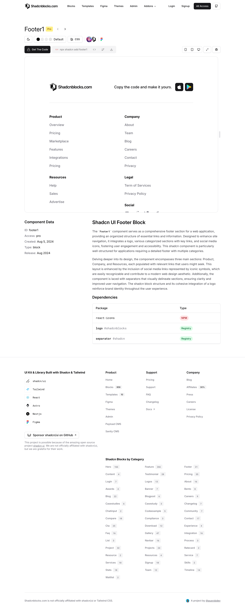

# Footer Blocks (21)

Site footer components with links and information. Include navigation, legal links, and social media.

---

## footer1

Centered stacked featuring structured content presentation and clear visual hierarchy. Displays logo placement and social media icons for enhanced user engagement. Perfect for navigation structure and conversion-focused applications. Professional design with responsive structure and mobile-optimized layout. Best applied in scenarios requiring navigation structure with professional visual impact.

**Install**: `pnpm dlx shadcn add @shadcnblocks/footer1`

---

## footer2

Grid structure including structured content presentation and clear visual hierarchy. Showcases social icons and copyright text for enhanced user engagement. Excellent for legal links and conversion-focused applications. Accessible design with responsive structure and mobile-optimized layout. Best applied in scenarios requiring legal links with professional visual impact.

**Install**: `pnpm dlx shadcn add @shadcnblocks/footer2`

---

## footer3

Multi-column layout with structured content presentation and clear visual hierarchy. Features link columns and navigation links for enhanced user engagement. Ideal for site footer and conversion-focused applications. Organized design with responsive structure and mobile-optimized layout. Best applied in scenarios requiring site footer with professional visual impact.

**Install**: `pnpm dlx shadcn add @shadcnblocks/footer3`

---

## footer4

Centered stacked featuring structured content presentation and clear visual hierarchy. Displays logo placement and social media icons for enhanced user engagement. Perfect for navigation structure and conversion-focused applications. Professional design with responsive structure and mobile-optimized layout. Best applied in scenarios requiring navigation structure with professional visual impact.

**Install**: `pnpm dlx shadcn add @shadcnblocks/footer4`

---

## footer5

Grid structure including structured content presentation and clear visual hierarchy. Showcases social icons and copyright text for enhanced user engagement. Excellent for legal links and conversion-focused applications. Accessible design with responsive structure and mobile-optimized layout. Best applied in scenarios requiring legal links with professional visual impact.

**Install**: `pnpm dlx shadcn add @shadcnblocks/footer5`

---

## footer6

Horizontal sections incorporating structured content presentation and clear visual hierarchy. Presents minimal design and newsletter form for enhanced user engagement. Well-suited for contact access and conversion-focused applications. Clean design with responsive structure and mobile-optimized layout. Best applied in scenarios requiring contact access with professional visual impact.

**Install**: `pnpm dlx shadcn add @shadcnblocks/footer6`

---

## footer7

Compact single-row containing structured content presentation and clear visual hierarchy. Includes separator lines and contact info for enhanced user engagement. Optimal for brand reinforcement and conversion-focused applications. Comprehensive design with responsive structure and mobile-optimized layout. Best applied in scenarios requiring brand reinforcement with professional visual impact.

**Install**: `pnpm dlx shadcn add @shadcnblocks/footer7`

---

## footer8

Multi-column layout with structured content presentation and clear visual hierarchy. Features link columns and navigation links for enhanced user engagement. Ideal for site footer and conversion-focused applications. Organized design with responsive structure and mobile-optimized layout. Best applied in scenarios requiring site footer with professional visual impact.

**Install**: `pnpm dlx shadcn add @shadcnblocks/footer8`

---

## footer9

Centered stacked featuring structured content presentation and clear visual hierarchy. Displays logo placement and social media icons for enhanced user engagement. Perfect for navigation structure and conversion-focused applications. Professional design with responsive structure and mobile-optimized layout. Best applied in scenarios requiring navigation structure with professional visual impact.

**Install**: `pnpm dlx shadcn add @shadcnblocks/footer9`

---

## footer10

Grid structure including structured content presentation and clear visual hierarchy. Showcases social icons and copyright text for enhanced user engagement. Excellent for legal links and conversion-focused applications. Accessible design with responsive structure and mobile-optimized layout. Best applied in scenarios requiring legal links with professional visual impact.

**Install**: `pnpm dlx shadcn add @shadcnblocks/footer10`

---

## footer11

Horizontal sections incorporating structured content presentation and clear visual hierarchy. Presents minimal design and newsletter form for enhanced user engagement. Well-suited for contact access and conversion-focused applications. Clean design with responsive structure and mobile-optimized layout. Best applied in scenarios requiring contact access with professional visual impact.

**Install**: `pnpm dlx shadcn add @shadcnblocks/footer11`

---

## footer12

Compact single-row containing structured content presentation and clear visual hierarchy. Includes separator lines and contact info for enhanced user engagement. Optimal for brand reinforcement and conversion-focused applications. Comprehensive design with responsive structure and mobile-optimized layout. Best applied in scenarios requiring brand reinforcement with professional visual impact.

**Install**: `pnpm dlx shadcn add @shadcnblocks/footer12`

---

## footer13

Multi-column layout with structured content presentation and clear visual hierarchy. Features link columns and navigation links for enhanced user engagement. Ideal for site footer and conversion-focused applications. Organized design with responsive structure and mobile-optimized layout. Best applied in scenarios requiring site footer with professional visual impact.

**Install**: `pnpm dlx shadcn add @shadcnblocks/footer13`

---

## footer14

Centered stacked featuring structured content presentation and clear visual hierarchy. Displays logo placement and social media icons for enhanced user engagement. Perfect for navigation structure and conversion-focused applications. Professional design with responsive structure and mobile-optimized layout. Best applied in scenarios requiring navigation structure with professional visual impact.

**Install**: `pnpm dlx shadcn add @shadcnblocks/footer14`

---

## footer15

Grid structure including structured content presentation and clear visual hierarchy. Showcases social icons and copyright text for enhanced user engagement. Excellent for legal links and conversion-focused applications. Accessible design with responsive structure and mobile-optimized layout. Best applied in scenarios requiring legal links with professional visual impact.

**Install**: `pnpm dlx shadcn add @shadcnblocks/footer15`

---

## footer16

Horizontal sections incorporating structured content presentation and clear visual hierarchy. Presents minimal design and newsletter form for enhanced user engagement. Well-suited for contact access and conversion-focused applications. Clean design with responsive structure and mobile-optimized layout. Best applied in scenarios requiring contact access with professional visual impact.

**Install**: `pnpm dlx shadcn add @shadcnblocks/footer16`

---

## footer17

Compact single-row containing structured content presentation and clear visual hierarchy. Includes separator lines and contact info for enhanced user engagement. Optimal for brand reinforcement and conversion-focused applications. Comprehensive design with responsive structure and mobile-optimized layout. Best applied in scenarios requiring brand reinforcement with professional visual impact.

**Install**: `pnpm dlx shadcn add @shadcnblocks/footer17`

---

## footer18

Multi-column layout with structured content presentation and clear visual hierarchy. Features link columns and navigation links for enhanced user engagement. Ideal for site footer and conversion-focused applications. Organized design with responsive structure and mobile-optimized layout. Best applied in scenarios requiring site footer with professional visual impact.

**Install**: `pnpm dlx shadcn add @shadcnblocks/footer18`

---

## footer19

Centered stacked featuring structured content presentation and clear visual hierarchy. Displays logo placement and social media icons for enhanced user engagement. Perfect for navigation structure and conversion-focused applications. Professional design with responsive structure and mobile-optimized layout. Best applied in scenarios requiring navigation structure with professional visual impact.

**Install**: `pnpm dlx shadcn add @shadcnblocks/footer19`

---

## footer20

Horizontal sections incorporating structured content presentation and clear visual hierarchy. Presents minimal design and newsletter form for enhanced user engagement. Well-suited for contact access and conversion-focused applications. Clean design with responsive structure and mobile-optimized layout. Best applied in scenarios requiring contact access with professional visual impact.

**Install**: `pnpm dlx shadcn add @shadcnblocks/footer20`

---

## footer21

Compact single-row containing structured content presentation and clear visual hierarchy. Includes separator lines and contact info for enhanced user engagement. Optimal for brand reinforcement and conversion-focused applications. Comprehensive design with responsive structure and mobile-optimized layout. Best applied in scenarios requiring brand reinforcement with professional visual impact.

**Install**: `pnpm dlx shadcn add @shadcnblocks/footer21`

---

