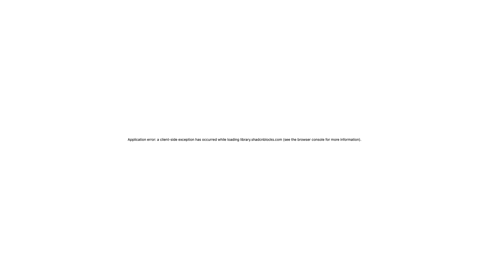

# Gallery Blocks (33)

Image galleries and portfolio showcases for visual content. Display photos, artwork, and project collections.

---

## gallery1

Masonry grid featuring structured content presentation and clear visual hierarchy. Displays hover effects and lightbox for enhanced user engagement. Perfect for photo galleries and conversion-focused applications. Clean design with responsive structure and mobile-optimized layout. Best applied in scenarios requiring photo galleries with professional visual impact.

**Install**: `pnpm dlx shadcn add @shadcnblocks/gallery1`

---

## gallery2

Carousel including structured content presentation and clear visual hierarchy. Showcases overlay captions and filter buttons for enhanced user engagement. Excellent for product images and conversion-focused applications. Organized design with responsive structure and mobile-optimized layout. Best applied in scenarios requiring product images with professional visual impact.

**Install**: `pnpm dlx shadcn add @shadcnblocks/gallery2`

---

## gallery3

Lightbox grid incorporating structured content presentation and clear visual hierarchy. Presents spacing and category tabs for enhanced user engagement. Well-suited for work displays and conversion-focused applications. Engaging design with responsive structure and mobile-optimized layout. Best applied in scenarios requiring work displays with professional visual impact.

**Install**: `pnpm dlx shadcn add @shadcnblocks/gallery3`

---

## gallery4

Lightbox grid incorporating structured content presentation and clear visual hierarchy. Presents spacing and category tabs for enhanced user engagement. Well-suited for work displays and conversion-focused applications. Engaging design with responsive structure and mobile-optimized layout. Best applied in scenarios requiring work displays with professional visual impact.

**Install**: `pnpm dlx shadcn add @shadcnblocks/gallery4`

---

## gallery5

Responsive columns containing structured content presentation and clear visual hierarchy. Includes aspect ratios and caption overlays for enhanced user engagement. Optimal for visual catalogs and conversion-focused applications. Responsive design with responsive structure and mobile-optimized layout. Best applied in scenarios requiring visual catalogs with professional visual impact.

**Install**: `pnpm dlx shadcn add @shadcnblocks/gallery5`

---

## gallery6

Grid layout with structured content presentation and clear visual hierarchy. Features image tiles and image cards for enhanced user engagement. Ideal for portfolio showcases and conversion-focused applications. Visual design with responsive structure and mobile-optimized layout. Best applied in scenarios requiring portfolio showcases with professional visual impact.

**Install**: `pnpm dlx shadcn add @shadcnblocks/gallery6`

---

## gallery7

Masonry grid featuring structured content presentation and clear visual hierarchy. Displays hover effects and lightbox for enhanced user engagement. Perfect for photo galleries and conversion-focused applications. Clean design with responsive structure and mobile-optimized layout. Best applied in scenarios requiring photo galleries with professional visual impact.

**Install**: `pnpm dlx shadcn add @shadcnblocks/gallery7`

---

## gallery8

Carousel including structured content presentation and clear visual hierarchy. Showcases overlay captions and filter buttons for enhanced user engagement. Excellent for product images and conversion-focused applications. Organized design with responsive structure and mobile-optimized layout. Best applied in scenarios requiring product images with professional visual impact.

**Install**: `pnpm dlx shadcn add @shadcnblocks/gallery8`

---

## gallery9

Lightbox grid incorporating structured content presentation and clear visual hierarchy. Presents spacing and category tabs for enhanced user engagement. Well-suited for work displays and conversion-focused applications. Engaging design with responsive structure and mobile-optimized layout. Best applied in scenarios requiring work displays with professional visual impact.

**Install**: `pnpm dlx shadcn add @shadcnblocks/gallery9`

---

## gallery10

Carousel including structured content presentation and clear visual hierarchy. Showcases overlay captions and filter buttons for enhanced user engagement. Excellent for product images and conversion-focused applications. Organized design with responsive structure and mobile-optimized layout. Best applied in scenarios requiring product images with professional visual impact.

**Install**: `pnpm dlx shadcn add @shadcnblocks/gallery10`

---

## gallery11

Lightbox grid incorporating structured content presentation and clear visual hierarchy. Presents spacing and category tabs for enhanced user engagement. Well-suited for work displays and conversion-focused applications. Engaging design with responsive structure and mobile-optimized layout. Best applied in scenarios requiring work displays with professional visual impact.

**Install**: `pnpm dlx shadcn add @shadcnblocks/gallery11`

---

## gallery12

Responsive columns containing structured content presentation and clear visual hierarchy. Includes aspect ratios and caption overlays for enhanced user engagement. Optimal for visual catalogs and conversion-focused applications. Responsive design with responsive structure and mobile-optimized layout. Best applied in scenarios requiring visual catalogs with professional visual impact.

**Install**: `pnpm dlx shadcn add @shadcnblocks/gallery12`

---

## gallery13

Grid layout with structured content presentation and clear visual hierarchy. Features image tiles and image cards for enhanced user engagement. Ideal for portfolio showcases and conversion-focused applications. Visual design with responsive structure and mobile-optimized layout. Best applied in scenarios requiring portfolio showcases with professional visual impact.

**Install**: `pnpm dlx shadcn add @shadcnblocks/gallery13`

---

## gallery14

Masonry grid featuring structured content presentation and clear visual hierarchy. Displays hover effects and lightbox for enhanced user engagement. Perfect for photo galleries and conversion-focused applications. Clean design with responsive structure and mobile-optimized layout. Best applied in scenarios requiring photo galleries with professional visual impact.

**Install**: `pnpm dlx shadcn add @shadcnblocks/gallery14`

---

## gallery15

Carousel including structured content presentation and clear visual hierarchy. Showcases overlay captions and filter buttons for enhanced user engagement. Excellent for product images and conversion-focused applications. Organized design with responsive structure and mobile-optimized layout. Best applied in scenarios requiring product images with professional visual impact.

**Install**: `pnpm dlx shadcn add @shadcnblocks/gallery15`

---

## gallery16

Lightbox grid incorporating structured content presentation and clear visual hierarchy. Presents spacing and category tabs for enhanced user engagement. Well-suited for work displays and conversion-focused applications. Engaging design with responsive structure and mobile-optimized layout. Best applied in scenarios requiring work displays with professional visual impact.

**Install**: `pnpm dlx shadcn add @shadcnblocks/gallery16`

---

## gallery17

Responsive columns containing structured content presentation and clear visual hierarchy. Includes aspect ratios and caption overlays for enhanced user engagement. Optimal for visual catalogs and conversion-focused applications. Responsive design with responsive structure and mobile-optimized layout. Best applied in scenarios requiring visual catalogs with professional visual impact.

**Install**: `pnpm dlx shadcn add @shadcnblocks/gallery17`

---

## gallery18

Grid layout with structured content presentation and clear visual hierarchy. Features image tiles and image cards for enhanced user engagement. Ideal for portfolio showcases and conversion-focused applications. Visual design with responsive structure and mobile-optimized layout. Best applied in scenarios requiring portfolio showcases with professional visual impact.

**Install**: `pnpm dlx shadcn add @shadcnblocks/gallery18`

---

## gallery19

Masonry grid featuring structured content presentation and clear visual hierarchy. Displays hover effects and lightbox for enhanced user engagement. Perfect for photo galleries and conversion-focused applications. Clean design with responsive structure and mobile-optimized layout. Best applied in scenarios requiring photo galleries with professional visual impact.

**Install**: `pnpm dlx shadcn add @shadcnblocks/gallery19`

---

## gallery20

Lightbox grid incorporating structured content presentation and clear visual hierarchy. Presents spacing and category tabs for enhanced user engagement. Well-suited for work displays and conversion-focused applications. Engaging design with responsive structure and mobile-optimized layout. Best applied in scenarios requiring work displays with professional visual impact.

**Install**: `pnpm dlx shadcn add @shadcnblocks/gallery20`

---

## gallery21

Responsive columns containing structured content presentation and clear visual hierarchy. Includes aspect ratios and caption overlays for enhanced user engagement. Optimal for visual catalogs and conversion-focused applications. Responsive design with responsive structure and mobile-optimized layout. Best applied in scenarios requiring visual catalogs with professional visual impact.

**Install**: `pnpm dlx shadcn add @shadcnblocks/gallery21`

---

## gallery22

Grid layout with structured content presentation and clear visual hierarchy. Features image tiles and image cards for enhanced user engagement. Ideal for portfolio showcases and conversion-focused applications. Visual design with responsive structure and mobile-optimized layout. Best applied in scenarios requiring portfolio showcases with professional visual impact.

**Install**: `pnpm dlx shadcn add @shadcnblocks/gallery22`

---

## gallery23

Masonry grid featuring structured content presentation and clear visual hierarchy. Displays hover effects and lightbox for enhanced user engagement. Perfect for photo galleries and conversion-focused applications. Clean design with responsive structure and mobile-optimized layout. Best applied in scenarios requiring photo galleries with professional visual impact.

**Install**: `pnpm dlx shadcn add @shadcnblocks/gallery23`

---

## gallery24

Carousel including structured content presentation and clear visual hierarchy. Showcases overlay captions and filter buttons for enhanced user engagement. Excellent for product images and conversion-focused applications. Organized design with responsive structure and mobile-optimized layout. Best applied in scenarios requiring product images with professional visual impact.

**Install**: `pnpm dlx shadcn add @shadcnblocks/gallery24`

---

## gallery25

Lightbox grid incorporating structured content presentation and clear visual hierarchy. Presents spacing and category tabs for enhanced user engagement. Well-suited for work displays and conversion-focused applications. Engaging design with responsive structure and mobile-optimized layout. Best applied in scenarios requiring work displays with professional visual impact.

**Install**: `pnpm dlx shadcn add @shadcnblocks/gallery25`

---

## gallery26

Responsive columns containing structured content presentation and clear visual hierarchy. Includes aspect ratios and caption overlays for enhanced user engagement. Optimal for visual catalogs and conversion-focused applications. Responsive design with responsive structure and mobile-optimized layout. Best applied in scenarios requiring visual catalogs with professional visual impact.

**Install**: `pnpm dlx shadcn add @shadcnblocks/gallery26`

---

## gallery27

Grid layout with structured content presentation and clear visual hierarchy. Features image tiles and image cards for enhanced user engagement. Ideal for portfolio showcases and conversion-focused applications. Visual design with responsive structure and mobile-optimized layout. Best applied in scenarios requiring portfolio showcases with professional visual impact.

**Install**: `pnpm dlx shadcn add @shadcnblocks/gallery27`

---

## gallery28

Masonry grid featuring structured content presentation and clear visual hierarchy. Displays hover effects and lightbox for enhanced user engagement. Perfect for photo galleries and conversion-focused applications. Clean design with responsive structure and mobile-optimized layout. Best applied in scenarios requiring photo galleries with professional visual impact.

**Install**: `pnpm dlx shadcn add @shadcnblocks/gallery28`

---

## gallery29

Carousel including structured content presentation and clear visual hierarchy. Showcases overlay captions and filter buttons for enhanced user engagement. Excellent for product images and conversion-focused applications. Organized design with responsive structure and mobile-optimized layout. Best applied in scenarios requiring product images with professional visual impact.

**Install**: `pnpm dlx shadcn add @shadcnblocks/gallery29`

---

## gallery30

Responsive columns containing structured content presentation and clear visual hierarchy. Includes aspect ratios and caption overlays for enhanced user engagement. Optimal for visual catalogs and conversion-focused applications. Responsive design with responsive structure and mobile-optimized layout. Best applied in scenarios requiring visual catalogs with professional visual impact.

**Install**: `pnpm dlx shadcn add @shadcnblocks/gallery30`

---

## gallery31

Grid layout with structured content presentation and clear visual hierarchy. Features image tiles and image cards for enhanced user engagement. Ideal for portfolio showcases and conversion-focused applications. Visual design with responsive structure and mobile-optimized layout. Best applied in scenarios requiring portfolio showcases with professional visual impact.

**Install**: `pnpm dlx shadcn add @shadcnblocks/gallery31`

---

## gallery32

Masonry grid featuring structured content presentation and clear visual hierarchy. Displays hover effects and lightbox for enhanced user engagement. Perfect for photo galleries and conversion-focused applications. Clean design with responsive structure and mobile-optimized layout. Best applied in scenarios requiring photo galleries with professional visual impact.

**Install**: `pnpm dlx shadcn add @shadcnblocks/gallery32`

---

## gallery33

Carousel including structured content presentation and clear visual hierarchy. Showcases overlay captions and filter buttons for enhanced user engagement. Excellent for product images and conversion-focused applications. Organized design with responsive structure and mobile-optimized layout. Best applied in scenarios requiring product images with professional visual impact.

**Install**: `pnpm dlx shadcn add @shadcnblocks/gallery33`

---

